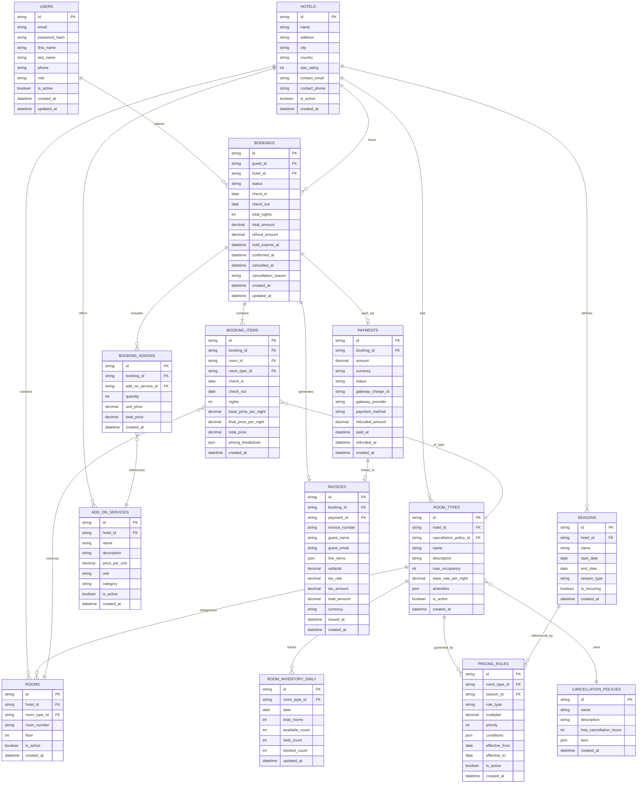

# ER Diagram — Hotel Room Booking & Yield Pricing System

## Mermaid ER Diagram

```mermaid
erDiagram

USERS {
    string id PK
    string email
    string password_hash
    string first_name
    string last_name
    string phone
    string role
    boolean is_active
    datetime created_at
    datetime updated_at
}

HOTELS {
    string id PK
    string name
    string address
    string city
    string country
    int star_rating
    string contact_email
    string contact_phone
    boolean is_active
    datetime created_at
}

CANCELLATION_POLICIES {
    string id PK
    string name
    string description
    int free_cancellation_hours
    json tiers
    datetime created_at
}

ROOM_TYPES {
    string id PK
    string hotel_id FK
    string cancellation_policy_id FK
    string name
    string description
    int max_occupancy
    decimal base_rate_per_night
    json amenities
    boolean is_active
    datetime created_at
}

ROOMS {
    string id PK
    string hotel_id FK
    string room_type_id FK
    string room_number
    int floor
    boolean is_active
    datetime created_at
}

ROOM_INVENTORY_DAILY {
    string id PK
    string room_type_id FK
    date date
    int total_rooms
    int available_count
    int held_count
    int booked_count
    datetime updated_at
}

SEASONS {
    string id PK
    string hotel_id FK
    string name
    date start_date
    date end_date
    string season_type
    boolean is_recurring
    datetime created_at
}

PRICING_RULES {
    string id PK
    string room_type_id FK
    string season_id FK
    string rule_type
    decimal multiplier
    int priority
    json conditions
    date effective_from
    date effective_to
    boolean is_active
    datetime created_at
}

BOOKINGS {
    string id PK
    string guest_id FK
    string hotel_id FK
    string status
    date check_in
    date check_out
    int total_nights
    decimal total_amount
    decimal refund_amount
    datetime hold_expires_at
    datetime confirmed_at
    datetime cancelled_at
    string cancellation_reason
    datetime created_at
    datetime updated_at
}

BOOKING_ITEMS {
    string id PK
    string booking_id FK
    string room_id FK
    string room_type_id FK
    date check_in
    date check_out
    int nights
    decimal base_price_per_night
    decimal final_price_per_night
    decimal total_price
    json pricing_breakdown
    datetime created_at
}

ADD_ON_SERVICES {
    string id PK
    string hotel_id FK
    string name
    string description
    decimal price_per_unit
    string unit
    string category
    boolean is_active
    datetime created_at
}

BOOKING_ADDONS {
    string id PK
    string booking_id FK
    string add_on_service_id FK
    int quantity
    decimal unit_price
    decimal total_price
    datetime created_at
}

PAYMENTS {
    string id PK
    string booking_id FK
    decimal amount
    string currency
    string status
    string gateway_charge_id
    string gateway_provider
    string payment_method
    decimal refunded_amount
    datetime paid_at
    datetime refunded_at
    datetime created_at
}

INVOICES {
    string id PK
    string booking_id FK
    string payment_id FK
    string invoice_number
    string guest_name
    string guest_email
    json line_items
    decimal subtotal
    decimal tax_rate
    decimal tax_amount
    decimal total_amount
    string currency
    datetime issued_at
    datetime created_at
}

HOTELS ||--o{ ROOM_TYPES : has
HOTELS ||--o{ ROOMS : contains
HOTELS ||--o{ SEASONS : defines
HOTELS ||--o{ ADD_ON_SERVICES : offers

ROOM_TYPES ||--o{ ROOMS : categorizes
ROOM_TYPES ||--o{ ROOM_INVENTORY_DAILY : tracks
ROOM_TYPES ||--o{ PRICING_RULES : governed_by
ROOM_TYPES }o--|| CANCELLATION_POLICIES : uses

SEASONS ||--o{ PRICING_RULES : referenced_by

USERS ||--o{ BOOKINGS : places
HOTELS ||--o{ BOOKINGS : hosts

BOOKINGS ||--|{ BOOKING_ITEMS : contains
BOOKINGS ||--o{ BOOKING_ADDONS : includes
BOOKINGS ||--o| PAYMENTS : paid_via
BOOKINGS ||--o| INVOICES : generates

BOOKING_ITEMS }o--|| ROOMS : reserves
BOOKING_ITEMS }o--|| ROOM_TYPES : of_type

BOOKING_ADDONS }o--|| ADD_ON_SERVICES : references

PAYMENTS ||--o| INVOICES : linked_to
```
