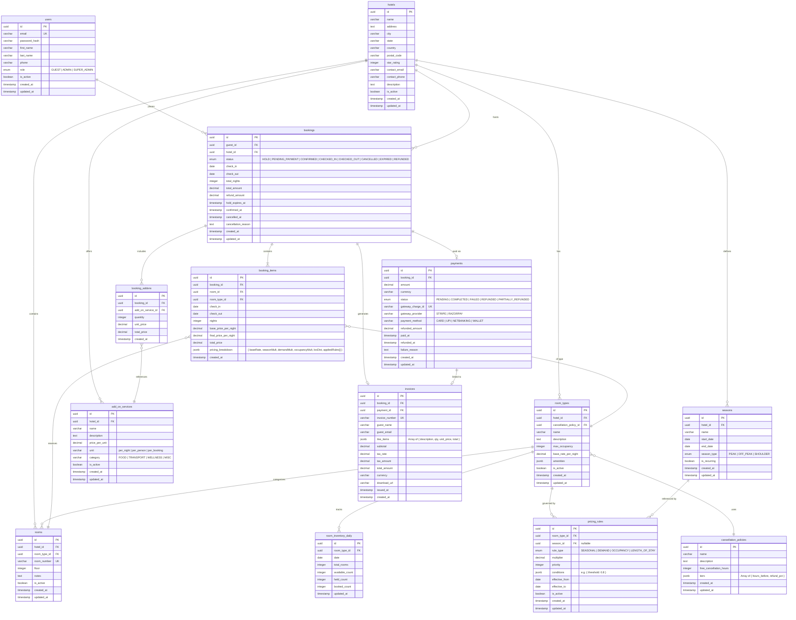

# 📄 ErDiagram.md — Hotel Room Booking & Yield Pricing System

---

## 1. Schema Overview

The database schema follows **3NF (Third Normal Form)** normalization. Key design decisions:

- **`room_inventory_daily`**: One row per room-type per date — enables atomic inventory operations and prevents double-booking via row-level locking
- **`booking_items`**: Separates the booking header from individual room reservations — supports multi-room bookings
- **`pricing_rules`**: Decoupled from room types — allows multiple rules per room type with priority ordering
- **`seasons`**: Referenced by pricing rules — allows season definitions to be reused across multiple rule configurations
- **`booking_addons`**: Junction table between bookings and add-on services with quantity and price snapshot

---

## 2. Mermaid ER Diagram



---

## 3. Table Descriptions & Constraints

### `room_inventory_daily`
> **Critical table** — one row per `(room_type_id, date)`. Unique constraint on `(room_type_id, date)`.

```sql
ALTER TABLE room_inventory_daily
  ADD CONSTRAINT uq_inventory_room_date UNIQUE (room_type_id, date);

ALTER TABLE room_inventory_daily
  ADD CONSTRAINT chk_counts_non_negative
    CHECK (available_count >= 0 AND held_count >= 0 AND booked_count >= 0);

ALTER TABLE room_inventory_daily
  ADD CONSTRAINT chk_counts_sum
    CHECK (available_count + held_count + booked_count = total_rooms);
```

### `bookings`
> Status transitions enforced at application layer; DB stores current state only.

```sql
ALTER TABLE bookings
  ADD CONSTRAINT chk_checkout_after_checkin
    CHECK (check_out > check_in);

ALTER TABLE bookings
  ADD CONSTRAINT chk_total_nights_positive
    CHECK (total_nights > 0);
```

### `pricing_rules`
> Multiple rules per room type; applied in `priority` order (lower = higher priority).

```sql
ALTER TABLE pricing_rules
  ADD CONSTRAINT chk_multiplier_positive
    CHECK (multiplier > 0);

ALTER TABLE pricing_rules
  ADD CONSTRAINT chk_effective_dates
    CHECK (effective_to >= effective_from);
```

### `payments`
> One payment per booking (enforced by unique constraint on `booking_id`).

```sql
ALTER TABLE payments
  ADD CONSTRAINT uq_booking_payment UNIQUE (booking_id);
```

---

## 4. Key Indexes

```sql
-- Availability queries (most frequent)
CREATE INDEX idx_inventory_room_type_date
  ON room_inventory_daily (room_type_id, date);

-- Booking lookups by guest
CREATE INDEX idx_bookings_guest_id
  ON bookings (guest_id);

-- Booking status filtering (scheduler jobs)
CREATE INDEX idx_bookings_status_hold_expires
  ON bookings (status, hold_expires_at)
  WHERE status = 'HOLD';

-- Pricing rule lookups
CREATE INDEX idx_pricing_rules_room_type_active
  ON pricing_rules (room_type_id, is_active, priority);

-- Invoice lookup by booking
CREATE INDEX idx_invoices_booking_id
  ON invoices (booking_id);
```

---

## 5. Normalization Notes

| Concern | Decision |
|---------|----------|
| `pricing_breakdown` stored as JSONB in `booking_items` | Denormalized intentionally — price audit trail must be immutable; separate table would require complex joins |
| `tiers` stored as JSONB in `cancellation_policies` | Tiers are always read/written together; JSONB avoids a separate `cancellation_tiers` table for simple cases |
| `amenities` stored as JSONB in `room_types` | Amenities are display-only; no filtering needed; JSONB is appropriate |
| `line_items` stored as JSONB in `invoices` | Invoice is a point-in-time document; line items must not change if booking is modified later |
| `seasons` is a separate table | Seasons are reused across multiple pricing rules; normalization avoids duplication |
