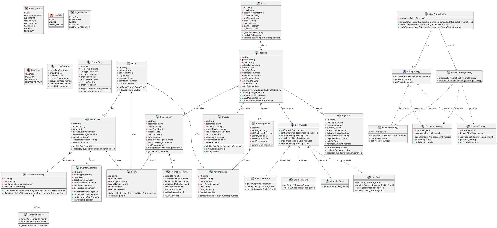

# Class Diagram — Hotel Room Booking & Yield Pricing System

## PlantUML Class Diagram

```plantuml
@startuml

enum BookingStatus {
  HOLD
  PENDING_PAYMENT
  CONFIRMED
  CHECKED_IN
  CHECKED_OUT
  CANCELLED
  EXPIRED
  REFUNDED
}

enum UserRole {
  GUEST
  ADMIN
  SUPER_ADMIN
}

enum PaymentStatus {
  PENDING
  COMPLETED
  FAILED
  REFUNDED
  PARTIALLY_REFUNDED
}

enum RuleType {
  SEASONAL
  DEMAND
  OCCUPANCY
  LENGTH_OF_STAY
}

class User {
  - id: string
  - email: string
  - passwordHash: string
  - firstName: string
  - lastName: string
  - phone: string
  - role: UserRole
  - isActive: boolean
  - createdAt: Date
  --
  + getFullName(): string
  + isAdmin(): boolean
  + validatePassword(plain: string): boolean
}

class Hotel {
  - id: string
  - name: string
  - address: string
  - city: string
  - country: string
  - starRating: number
  - isActive: boolean
  --
  + getRoomTypes(): RoomType[]
  + isOperational(): boolean
}

class RoomType {
  - id: string
  - hotelId: string
  - name: string
  - maxOccupancy: number
  - baseRatePerNight: number
  - amenities: string[]
  - cancellationPolicyId: string
  - isActive: boolean
  --
  + getBaseRate(): number
  + supportsOccupancy(guests: number): boolean
}

class Room {
  - id: string
  - hotelId: string
  - roomTypeId: string
  - roomNumber: string
  - floor: number
  - isActive: boolean
  --
  + isAvailable(checkIn: Date, checkOut: Date): boolean
  + deactivate(): void
}

class InventoryCalendar {
  - id: string
  - roomTypeId: string
  - date: Date
  - totalRooms: number
  - availableCount: number
  - heldCount: number
  - bookedCount: number
  --
  + decrementAvailable(): void
  + incrementAvailable(): void
  + getOccupancyRate(): number
  + isAvailable(): boolean
}

class Booking {
  - id: string
  - guestId: string
  - hotelId: string
  - status: BookingStatus
  - checkIn: Date
  - checkOut: Date
  - totalNights: number
  - totalAmount: number
  - holdExpiresAt: Date
  - confirmedAt: Date
  - cancelledAt: Date
  - state: BookingState
  --
  + transitionTo(newStatus: BookingStatus): void
  + isHoldExpired(): boolean
  + canBeCancelled(): boolean
  + canBeModified(): boolean
  + calculateRefundAmount(): number
}

class BookingItem {
  - id: string
  - bookingId: string
  - roomId: string
  - roomTypeId: string
  - checkIn: Date
  - checkOut: Date
  - nights: number
  - basePricePerNight: number
  - finalPricePerNight: number
  - totalPrice: number
  - pricingBreakdown: PricingBreakdown
  --
  + getLineTotal(): number
}

class BookingAddon {
  - id: string
  - bookingId: string
  - addOnServiceId: string
  - quantity: number
  - unitPrice: number
  - totalPrice: number
  --
  + getLineTotal(): number
}

class PricingBreakdown {
  - baseRate: number
  - seasonMultiplier: number
  - demandMultiplier: number
  - occupancyMultiplier: number
  - losDiscount: number
  - finalRate: number
  - appliedRules: string[]
  --
  + toJSON(): object
}

class Payment {
  - id: string
  - bookingId: string
  - amount: number
  - currency: string
  - status: PaymentStatus
  - gatewayChargeId: string
  - gatewayProvider: string
  - paymentMethod: string
  - paidAt: Date
  - refundedAmount: number
  --
  + isCompleted(): boolean
  + canBeRefunded(): boolean
  + processRefund(amount: number): void
}

class Invoice {
  - id: string
  - bookingId: string
  - paymentId: string
  - invoiceNumber: string
  - lineItems: InvoiceLineItem[]
  - subtotal: number
  - taxAmount: number
  - totalAmount: number
  - issuedAt: Date
  --
  + addLineItem(item: InvoiceLineItem): void
  + computeTotals(): void
  + toPDF(): Buffer
}

class CancellationPolicy {
  - id: string
  - name: string
  - freeCancellationHours: number
  - tiers: CancellationTier[]
  --
  + computeRefundAmount(booking: Booking, cancelAt: Date): number
  + isFreeCancellationWindow(cancelAt: Date, checkIn: Date): boolean
}

class CancellationTier {
  - hoursBeforeCheckIn: number
  - refundPercentage: number
  --
  + getRefundFraction(): number
}

class AddOnService {
  - id: string
  - hotelId: string
  - name: string
  - pricePerUnit: number
  - unit: string
  - category: string
  - isActive: boolean
  --
  + computePrice(quantity: number): number
}

interface PricingStrategy {
  + apply(context: PricingContext): number
  + getName(): string
  + getPriority(): number
}

class PricingContext {
  + roomTypeId: string
  + checkIn: Date
  + checkOut: Date
  + currentPrice: number
  + occupancyRate: number
  + demandIndex: number
  + totalNights: number
}

class PricingRule {
  - id: string
  - roomTypeId: string
  - ruleType: RuleType
  - multiplier: number
  - priority: number
  - effectiveFrom: Date
  - effectiveTo: Date
  - isActive: boolean
  --
  + isApplicable(date: Date): boolean
  + getMultiplier(): number
}

class SeasonalStrategy {
  - rule: PricingRule
  --
  + apply(context: PricingContext): number
  + getName(): string
  + getPriority(): number
}

class DemandStrategy {
  - rule: PricingRule
  - demandThreshold: number
  --
  + apply(context: PricingContext): number
  + getName(): string
  + getPriority(): number
}

class OccupancyStrategy {
  - rule: PricingRule
  - occupancyThreshold: number
  --
  + apply(context: PricingContext): number
  + getName(): string
  + getPriority(): number
}

class YieldPricingEngine {
  - strategies: PricingStrategy[]
  --
  + computePrice(roomTypeId: string, checkIn: Date, checkOut: Date): PricingResult
  + loadStrategies(roomTypeId: string, dates: Date[]): void
  + applyStrategies(baseRate: number, context: PricingContext): number
}

class PricingStrategyFactory {
  + {static} create(rule: PricingRule): PricingStrategy
  + {static} createAll(rules: PricingRule[]): PricingStrategy[]
}

interface BookingState {
  + getStatus(): BookingStatus
  + confirmPayment(booking: Booking): void
  + cancel(booking: Booking): void
  + checkIn(booking: Booking): void
  + checkOut(booking: Booking): void
  + expire(booking: Booking): void
}

class HoldState {
  + getStatus(): BookingStatus
  + confirmPayment(booking: Booking): void
  + cancel(booking: Booking): void
  + expire(booking: Booking): void
}

class ConfirmedState {
  + getStatus(): BookingStatus
  + cancel(booking: Booking): void
  + checkIn(booking: Booking): void
}

class CheckedInState {
  + getStatus(): BookingStatus
  + checkOut(booking: Booking): void
}

class CancelledState {
  + getStatus(): BookingStatus
}

' Relationships
User "1" --> "0..*" Booking : places
Hotel "1" *-- "1..*" RoomType : has
Hotel "1" *-- "1..*" Room : owns
Hotel "1" *-- "0..*" AddOnService : offers
RoomType "1" *-- "1..*" Room : contains
RoomType "1" *-- "0..*" InventoryCalendar : tracks
RoomType "0..*" --> "1" CancellationPolicy : governed by
Booking "1" *-- "1..*" BookingItem : contains
Booking "1" *-- "0..*" BookingAddon : includes
Booking "1" --> "1" Payment : paid via
Booking "1" --> "1" Invoice : generates
Booking --> BookingState : current state
BookingItem "0..*" --> "1" Room : reserves
BookingItem "1" *-- "1" PricingBreakdown : stores
BookingAddon "0..*" --> "1" AddOnService : references
CancellationPolicy "1" *-- "1..*" CancellationTier : defines
PricingStrategy <|.. SeasonalStrategy : implements
PricingStrategy <|.. DemandStrategy : implements
PricingStrategy <|.. OccupancyStrategy : implements
YieldPricingEngine "1" o-- "1..*" PricingStrategy : uses
YieldPricingEngine --> PricingStrategyFactory : creates via
PricingStrategyFactory ..> SeasonalStrategy : <<creates>>
PricingStrategyFactory ..> DemandStrategy : <<creates>>
PricingStrategyFactory ..> OccupancyStrategy : <<creates>>
BookingState <|.. HoldState : implements
BookingState <|.. ConfirmedState : implements
BookingState <|.. CheckedInState : implements
BookingState <|.. CancelledState : implements

@enduml
```
