# 📄 classDiagram.md — Hotel Room Booking & Yield Pricing System

---

## 1. Domain Class Overview

| Class / Interface | Type | Responsibility |
|-------------------|------|----------------|
| `User` | Entity | Represents a registered user (Guest or Admin) |
| `Hotel` | Entity | Represents a hotel property |
| `RoomType` | Entity | Defines a category of room (Standard, Deluxe, Suite) with base rate |
| `Room` | Entity | A physical room belonging to a hotel and room type |
| `InventoryCalendar` | Entity | Tracks available room count per room type per day |
| `Booking` | Entity + State Machine | Core booking aggregate; manages lifecycle state |
| `BookingItem` | Entity | Line item: one room for a date range with computed price |
| `Payment` | Entity | Payment record linked to a booking |
| `Invoice` | Entity | Itemized invoice generated post-payment |
| `PricingStrategy` | Interface | Contract for all yield pricing strategy implementations |
| `SeasonalStrategy` | Strategy | Applies seasonal multiplier based on defined seasons |
| `DemandStrategy` | Strategy | Applies demand-based multiplier from booking velocity |
| `OccupancyStrategy` | Strategy | Applies multiplier when occupancy exceeds threshold |
| `YieldPricingEngine` | Service | Orchestrates strategies; computes final price |
| `CancellationPolicy` | Entity | Defines refund tiers and free-cancellation windows |
| `AddOnService` | Entity | Represents an optional service (breakfast, spa, etc.) |
| `BookingAddon` | Association | Links add-on services to a booking with quantity/price |
| `BookingState` | Interface | State pattern contract for booking lifecycle states |
| `PricingStrategyFactory` | Factory | Creates strategy instances from rule configuration |

---

## 2. PlantUML Class Diagram

```plantuml
@startuml Hotel_Booking_ClassDiagram

skinparam classAttributeIconSize 0
skinparam classFontSize 12
skinparam classBackgroundColor LightYellow
skinparam classBorderColor DarkOrange
skinparam interfaceBackgroundColor LightCyan
skinparam interfaceBorderColor SteelBlue
skinparam abstractBackgroundColor LightGreen
skinparam abstractBorderColor DarkGreen
skinparam arrowColor DarkSlateGray
skinparam packageBackgroundColor WhiteSmoke
skinparam packageBorderColor Gray

' â•â•â•â•â•â•â•â•â•â•â•â•â•â•â•â•â•â•â•â•â•â•â•â•â•â•â•â•â•â•â•â•â•â•â•â•â•â•â•â•â•â•â•â•â•â•â•â•â•â•â•â•â•â•â•
' ENUMERATIONS
' â•â•â•â•â•â•â•â•â•â•â•â•â•â•â•â•â•â•â•â•â•â•â•â•â•â•â•â•â•â•â•â•â•â•â•â•â•â•â•â•â•â•â•â•â•â•â•â•â•â•â•â•â•â•â•
enum BookingStatus {
  HOLD
  PENDING_PAYMENT
  CONFIRMED
  CHECKED_IN
  CHECKED_OUT
  CANCELLED
  EXPIRED
  REFUNDED
}

enum UserRole {
  GUEST
  ADMIN
  SUPER_ADMIN
}

enum PaymentStatus {
  PENDING
  COMPLETED
  FAILED
  REFUNDED
  PARTIALLY_REFUNDED
}

enum RuleType {
  SEASONAL
  DEMAND
  OCCUPANCY
  LENGTH_OF_STAY
}

' â•â•â•â•â•â•â•â•â•â•â•â•â•â•â•â•â•â•â•â•â•â•â•â•â•â•â•â•â•â•â•â•â•â•â•â•â•â•â•â•â•â•â•â•â•â•â•â•â•â•â•â•â•â•â•
' CORE DOMAIN ENTITIES
' â•â•â•â•â•â•â•â•â•â•â•â•â•â•â•â•â•â•â•â•â•â•â•â•â•â•â•â•â•â•â•â•â•â•â•â•â•â•â•â•â•â•â•â•â•â•â•â•â•â•â•â•â•â•â•
package "User Domain" {
  class User {
    - id: string
    - email: string
    - passwordHash: string
    - firstName: string
    - lastName: string
    - phone: string
    - role: UserRole
    - isActive: boolean
    - createdAt: Date
    - updatedAt: Date
    --
    + getFullName(): string
    + isAdmin(): boolean
    + validatePassword(plain: string): boolean
    + toSafeDTO(): UserDTO
  }
}

package "Hotel Domain" {
  class Hotel {
    - id: string
    - name: string
    - address: string
    - city: string
    - country: string
    - starRating: number
    - contactEmail: string
    - contactPhone: string
    - isActive: boolean
    - createdAt: Date
    --
    + addRoomType(roomType: RoomType): void
    + getRoomTypes(): RoomType[]
    + isOperational(): boolean
  }

  class RoomType {
    - id: string
    - hotelId: string
    - name: string
    - description: string
    - maxOccupancy: number
    - baseRatePerNight: number
    - amenities: string[]
    - cancellationPolicyId: string
    - isActive: boolean
    --
    + getBaseRate(): number
    + supportsOccupancy(guests: number): boolean
    + getCancellationPolicy(): CancellationPolicy
  }

  class Room {
    - id: string
    - hotelId: string
    - roomTypeId: string
    - roomNumber: string
    - floor: number
    - isActive: boolean
    - notes: string
    --
    + getRoomType(): RoomType
    + isAvailable(checkIn: Date, checkOut: Date): boolean
    + deactivate(): void
  }

  class InventoryCalendar {
    - id: string
    - roomTypeId: string
    - date: Date
    - totalRooms: number
    - availableCount: number
    - heldCount: number
    - bookedCount: number
    --
    + decrementAvailable(): void
    + incrementAvailable(): void
    + holdRoom(): void
    + releaseHold(): void
    + getOccupancyRate(): number
    + isAvailable(): boolean
  }
}

package "Booking Domain" {
  class Booking {
    - id: string
    - guestId: string
    - hotelId: string
    - status: BookingStatus
    - checkIn: Date
    - checkOut: Date
    - totalNights: number
    - totalAmount: number
    - holdExpiresAt: Date
    - confirmedAt: Date
    - cancelledAt: Date
    - cancellationReason: string
    - createdAt: Date
    - updatedAt: Date
    - state: BookingState
    --
    + transitionTo(newStatus: BookingStatus): void
    + isHoldExpired(): boolean
    + canBeCancelled(): boolean
    + canBeModified(): boolean
    + getTotalNights(): number
    + getBookingItems(): BookingItem[]
    + getAddOns(): BookingAddon[]
    + calculateRefundAmount(): number
  }

  class BookingItem {
    - id: string
    - bookingId: string
    - roomId: string
    - roomTypeId: string
    - checkIn: Date
    - checkOut: Date
    - nights: number
    - basePricePerNight: number
    - finalPricePerNight: number
    - totalPrice: number
    - pricingBreakdown: PricingBreakdown
    --
    + getLineTotal(): number
    + getPricingBreakdown(): PricingBreakdown
  }

  class BookingAddon {
    - id: string
    - bookingId: string
    - addOnServiceId: string
    - quantity: number
    - unitPrice: number
    - totalPrice: number
    --
    + getLineTotal(): number
  }

  class PricingBreakdown {
    - baseRate: number
    - seasonMultiplier: number
    - demandMultiplier: number
    - occupancyMultiplier: number
    - losDiscount: number
    - finalRate: number
    - appliedRules: string[]
    --
    + toJSON(): object
    + getSummary(): string
  }
}

package "Payment Domain" {
  class Payment {
    - id: string
    - bookingId: string
    - amount: number
    - currency: string
    - status: PaymentStatus
    - gatewayChargeId: string
    - gatewayProvider: string
    - paymentMethod: string
    - paidAt: Date
    - refundedAmount: number
    - refundedAt: Date
    - failureReason: string
    --
    + isCompleted(): boolean
    + canBeRefunded(): boolean
    + processRefund(amount: number): void
    + getNetAmount(): number
  }

  class Invoice {
    - id: string
    - bookingId: string
    - paymentId: string
    - invoiceNumber: string
    - guestName: string
    - guestEmail: string
    - lineItems: InvoiceLineItem[]
    - subtotal: number
    - taxAmount: number
    - taxRate: number
    - totalAmount: number
    - currency: string
    - issuedAt: Date
    - downloadUrl: string
    --
    + addLineItem(item: InvoiceLineItem): void
    + computeTotals(): void
    + generateInvoiceNumber(): string
    + toPDF(): Buffer
    + toJSON(): object
  }

  class InvoiceLineItem {
    - description: string
    - quantity: number
    - unitPrice: number
    - totalPrice: number
    --
    + getTotal(): number
  }
}

package "Policy Domain" {
  class CancellationPolicy {
    - id: string
    - name: string
    - description: string
    - freeCancellationHours: number
    - tiers: CancellationTier[]
    --
    + computeRefundAmount(booking: Booking, cancelAt: Date): number
    + getApplicableTier(hoursUntilCheckIn: number): CancellationTier
    + isFreeCancellationWindow(cancelAt: Date, checkIn: Date): boolean
  }

  class CancellationTier {
    - hoursBeforeCheckIn: number
    - refundPercentage: number
    - description: string
    --
    + getRefundFraction(): number
  }

  class AddOnService {
    - id: string
    - hotelId: string
    - name: string
    - description: string
    - pricePerUnit: number
    - unit: string
    - isActive: boolean
    - category: string
    --
    + isAvailable(): boolean
    + computePrice(quantity: number): number
  }
}

' â•â•â•â•â•â•â•â•â•â•â•â•â•â•â•â•â•â•â•â•â•â•â•â•â•â•â•â•â•â•â•â•â•â•â•â•â•â•â•â•â•â•â•â•â•â•â•â•â•â•â•â•â•â•â•
' PRICING ENGINE — STRATEGY PATTERN
' â•â•â•â•â•â•â•â•â•â•â•â•â•â•â•â•â•â•â•â•â•â•â•â•â•â•â•â•â•â•â•â•â•â•â•â•â•â•â•â•â•â•â•â•â•â•â•â•â•â•â•â•â•â•â•
package "Pricing Engine" {

  interface PricingStrategy {
    + apply(context: PricingContext): number
    + getName(): string
    + getPriority(): number
  }

  class PricingContext {
    + roomTypeId: string
    + checkIn: Date
    + checkOut: Date
    + currentPrice: number
    + occupancyRate: number
    + demandIndex: number
    + totalNights: number
    + rule: PricingRule
  }

  class PricingRule {
    - id: string
    - roomTypeId: string
    - ruleType: RuleType
    - multiplier: number
    - priority: number
    - effectiveFrom: Date
    - effectiveTo: Date
    - conditions: object
    - isActive: boolean
    --
    + isApplicable(date: Date): boolean
    + getMultiplier(): number
  }

  class SeasonalStrategy {
    - rule: PricingRule
    - seasonId: string
    --
    + apply(context: PricingContext): number
    + getName(): string
    + getPriority(): number
    - isDateInSeason(date: Date): boolean
  }

  class DemandStrategy {
    - rule: PricingRule
    - demandThreshold: number
    --
    + apply(context: PricingContext): number
    + getName(): string
    + getPriority(): number
    - computeDemandIndex(roomTypeId: string, dates: Date[]): number
  }

  class OccupancyStrategy {
    - rule: PricingRule
    - occupancyThreshold: number
    --
    + apply(context: PricingContext): number
    + getName(): string
    + getPriority(): number
    - getOccupancyRate(roomTypeId: string, dates: Date[]): number
  }

  class LengthOfStayStrategy {
    - rule: PricingRule
    - minNights: number
    - discountRate: number
    --
    + apply(context: PricingContext): number
    + getName(): string
    + getPriority(): number
  }

  class YieldPricingEngine {
    - strategies: PricingStrategy[]
    - pricingRuleRepository: PricingRuleRepository
    - inventoryRepository: InventoryRepository
    --
    + computePrice(roomTypeId: string, checkIn: Date, checkOut: Date): PricingResult
    + loadStrategies(roomTypeId: string, dates: Date[]): void
    + applyStrategies(baseRate: number, context: PricingContext): number
    + buildContext(roomTypeId: string, checkIn: Date, checkOut: Date): PricingContext
  }

  class PricingResult {
    + baseRate: number
    + pricePerNight: number
    + totalPrice: number
    + nights: number
    + breakdown: PricingBreakdown
    + appliedStrategies: string[]
    --
    + toDTO(): object
  }

  class PricingStrategyFactory {
    + {static} create(rule: PricingRule): PricingStrategy
    + {static} createAll(rules: PricingRule[]): PricingStrategy[]
  }
}

' â•â•â•â•â•â•â•â•â•â•â•â•â•â•â•â•â•â•â•â•â•â•â•â•â•â•â•â•â•â•â•â•â•â•â•â•â•â•â•â•â•â•â•â•â•â•â•â•â•â•â•â•â•â•â•
' STATE PATTERN — BOOKING LIFECYCLE
' â•â•â•â•â•â•â•â•â•â•â•â•â•â•â•â•â•â•â•â•â•â•â•â•â•â•â•â•â•â•â•â•â•â•â•â•â•â•â•â•â•â•â•â•â•â•â•â•â•â•â•â•â•â•â•
package "Booking State Machine" {

  interface BookingState {
    + getStatus(): BookingStatus
    + confirmPayment(booking: Booking): void
    + cancel(booking: Booking): void
    + checkIn(booking: Booking): void
    + checkOut(booking: Booking): void
    + expire(booking: Booking): void
  }

  class HoldState {
    + getStatus(): BookingStatus
    + confirmPayment(booking: Booking): void
    + cancel(booking: Booking): void
    + expire(booking: Booking): void
    + checkIn(booking: Booking): void
    + checkOut(booking: Booking): void
  }

  class PendingPaymentState {
    + getStatus(): BookingStatus
    + confirmPayment(booking: Booking): void
    + cancel(booking: Booking): void
    + expire(booking: Booking): void
    + checkIn(booking: Booking): void
    + checkOut(booking: Booking): void
  }

  class ConfirmedState {
    + getStatus(): BookingStatus
    + confirmPayment(booking: Booking): void
    + cancel(booking: Booking): void
    + checkIn(booking: Booking): void
    + checkOut(booking: Booking): void
    + expire(booking: Booking): void
  }

  class CheckedInState {
    + getStatus(): BookingStatus
    + checkOut(booking: Booking): void
    + confirmPayment(booking: Booking): void
    + cancel(booking: Booking): void
    + checkIn(booking: Booking): void
    + expire(booking: Booking): void
  }

  class CheckedOutState {
    + getStatus(): BookingStatus
    + confirmPayment(booking: Booking): void
    + cancel(booking: Booking): void
    + checkIn(booking: Booking): void
    + checkOut(booking: Booking): void
    + expire(booking: Booking): void
  }

  class CancelledState {
    + getStatus(): BookingStatus
    + confirmPayment(booking: Booking): void
    + cancel(booking: Booking): void
    + checkIn(booking: Booking): void
    + checkOut(booking: Booking): void
    + expire(booking: Booking): void
  }
}

' â•â•â•â•â•â•â•â•â•â•â•â•â•â•â•â•â•â•â•â•â•â•â•â•â•â•â•â•â•â•â•â•â•â•â•â•â•â•â•â•â•â•â•â•â•â•â•â•â•â•â•â•â•â•â•
' RELATIONSHIPS
' â•â•â•â•â•â•â•â•â•â•â•â•â•â•â•â•â•â•â•â•â•â•â•â•â•â•â•â•â•â•â•â•â•â•â•â•â•â•â•â•â•â•â•â•â•â•â•â•â•â•â•â•â•â•â•

' User ↔ Booking
User "1" --> "0..*" Booking : places

' Hotel ↔ RoomType ↔ Room
Hotel "1" *-- "1..*" RoomType : has
RoomType "1" *-- "1..*" Room : contains
Hotel "1" *-- "1..*" Room : owns

' Hotel ↔ AddOnService
Hotel "1" *-- "0..*" AddOnService : offers

' RoomType ↔ CancellationPolicy
RoomType "0..*" --> "1" CancellationPolicy : governed by

' RoomType ↔ InventoryCalendar
RoomType "1" *-- "0..*" InventoryCalendar : tracks inventory

' Booking ↔ BookingItem ↔ BookingAddon
Booking "1" *-- "1..*" BookingItem : contains
Booking "1" *-- "0..*" BookingAddon : includes
Booking "1" --> "1" Payment : paid via
Booking "1" --> "1" Invoice : generates

' BookingItem ↔ Room / RoomType
BookingItem "0..*" --> "1" Room : reserves
BookingItem "0..*" --> "1" RoomType : of type
BookingItem "1" *-- "1" PricingBreakdown : stores

' BookingAddon ↔ AddOnService
BookingAddon "0..*" --> "1" AddOnService : references

' Payment ↔ Invoice
Payment "1" --> "1" Invoice : linked to

' Invoice ↔ InvoiceLineItem
Invoice "1" *-- "1..*" InvoiceLineItem : composed of

' CancellationPolicy ↔ CancellationTier
CancellationPolicy "1" *-- "1..*" CancellationTier : defines

' Pricing Strategy Implementations
PricingStrategy <|.. SeasonalStrategy : implements
PricingStrategy <|.. DemandStrategy : implements
PricingStrategy <|.. OccupancyStrategy : implements
PricingStrategy <|.. LengthOfStayStrategy : implements

' YieldPricingEngine ↔ Strategies
YieldPricingEngine "1" o-- "1..*" PricingStrategy : uses
YieldPricingEngine --> PricingStrategyFactory : creates via
YieldPricingEngine --> PricingResult : produces

' PricingRule ↔ Strategies
SeasonalStrategy --> PricingRule : configured by
DemandStrategy --> PricingRule : configured by
OccupancyStrategy --> PricingRule : configured by
LengthOfStayStrategy --> PricingRule : configured by

' PricingStrategyFactory
PricingStrategyFactory ..> SeasonalStrategy : <<creates>>
PricingStrategyFactory ..> DemandStrategy : <<creates>>
PricingStrategyFactory ..> OccupancyStrategy : <<creates>>
PricingStrategyFactory ..> LengthOfStayStrategy : <<creates>>

' State Pattern
BookingState <|.. HoldState : implements
BookingState <|.. PendingPaymentState : implements
BookingState <|.. ConfirmedState : implements
BookingState <|.. CheckedInState : implements
BookingState <|.. CheckedOutState : implements
BookingState <|.. CancelledState : implements

Booking --> BookingState : current state
Booking --> BookingStatus : has status

' Enums
User --> UserRole
Payment --> PaymentStatus
PricingRule --> RuleType

@enduml
```

---

## 3. Key Design Decisions

### 3.1 Booking as Aggregate Root
`Booking` is the aggregate root of the booking domain. All access to `BookingItem` and `BookingAddon` goes through `Booking`. This ensures consistency — you cannot create a `BookingItem` without a valid `Booking`.

### 3.2 PricingStrategy as Interface
`PricingStrategy` is a pure interface (no implementation). This enforces the **Open/Closed Principle** — new pricing strategies can be added without modifying `YieldPricingEngine`.

### 3.3 PricingBreakdown as Value Object
`PricingBreakdown` is a value object embedded in `BookingItem`. It stores the full audit trail of how the price was computed, enabling transparency and dispute resolution.

### 3.4 State Pattern for Booking Lifecycle
Each `BookingState` implementation knows which transitions are valid from its state. Invalid transitions throw `InvalidStateTransitionException`. This prevents bugs like confirming an already-cancelled booking.

### 3.5 Composition over Inheritance
`Booking` does not inherit from a base entity class. Instead, it composes `BookingState`, `BookingItem[]`, and `BookingAddon[]`. This avoids deep inheritance hierarchies and keeps the class focused.
