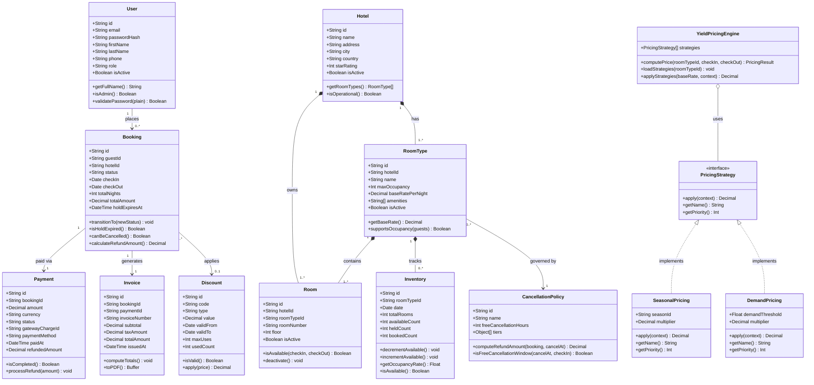

# Class Diagram — Hotel Room Booking & Yield Pricing System

## Mermaid Class Diagram

```mermaid
classDiagram

    class User {
        +String id
        +String email
        +String passwordHash
        +String firstName
        +String lastName
        +String phone
        +String role
        +Boolean isActive
        +getFullName() String
        +isAdmin() Boolean
        +validatePassword(plain) Boolean
    }

    class Hotel {
        +String id
        +String name
        +String address
        +String city
        +String country
        +Int starRating
        +Boolean isActive
        +getRoomTypes() RoomType[]
        +isOperational() Boolean
    }

    class RoomType {
        +String id
        +String hotelId
        +String name
        +Int maxOccupancy
        +Decimal baseRatePerNight
        +String[] amenities
        +Boolean isActive
        +getBaseRate() Decimal
        +supportsOccupancy(guests) Boolean
    }

    class Room {
        +String id
        +String hotelId
        +String roomTypeId
        +String roomNumber
        +Int floor
        +Boolean isActive
        +isAvailable(checkIn, checkOut) Boolean
        +deactivate() void
    }

    class Inventory {
        +String id
        +String roomTypeId
        +Date date
        +Int totalRooms
        +Int availableCount
        +Int heldCount
        +Int bookedCount
        +decrementAvailable() void
        +incrementAvailable() void
        +getOccupancyRate() Float
        +isAvailable() Boolean
    }

    class Booking {
        +String id
        +String guestId
        +String hotelId
        +String status
        +Date checkIn
        +Date checkOut
        +Int totalNights
        +Decimal totalAmount
        +DateTime holdExpiresAt
        +transitionTo(newStatus) void
        +isHoldExpired() Boolean
        +canBeCancelled() Boolean
        +calculateRefundAmount() Decimal
    }

    class Payment {
        +String id
        +String bookingId
        +Decimal amount
        +String currency
        +String status
        +String gatewayChargeId
        +String paymentMethod
        +DateTime paidAt
        +Decimal refundedAmount
        +isCompleted() Boolean
        +processRefund(amount) void
    }

    class Invoice {
        +String id
        +String bookingId
        +String paymentId
        +String invoiceNumber
        +Decimal subtotal
        +Decimal taxAmount
        +Decimal totalAmount
        +DateTime issuedAt
        +computeTotals() void
        +toPDF() Buffer
    }

    class CancellationPolicy {
        +String id
        +String name
        +Int freeCancellationHours
        +Object[] tiers
        +computeRefundAmount(booking, cancelAt) Decimal
        +isFreeCancellationWindow(cancelAt, checkIn) Boolean
    }

    class Discount {
        +String id
        +String code
        +String type
        +Decimal value
        +Date validFrom
        +Date validTo
        +Int maxUses
        +Int usedCount
        +isValid() Boolean
        +apply(price) Decimal
    }

    class PricingStrategy {
        <<interface>>
        +apply(context) Decimal
        +getName() String
        +getPriority() Int
    }

    class SeasonalPricing {
        +String seasonId
        +Decimal multiplier
        +apply(context) Decimal
        +getName() String
        +getPriority() Int
    }

    class DemandPricing {
        +Float demandThreshold
        +Decimal multiplier
        +apply(context) Decimal
        +getName() String
        +getPriority() Int
    }

    class YieldPricingEngine {
        +PricingStrategy[] strategies
        +computePrice(roomTypeId, checkIn, checkOut) PricingResult
        +loadStrategies(roomTypeId) void
        +applyStrategies(baseRate, context) Decimal
    }

    PricingStrategy <|.. SeasonalPricing : implements
    PricingStrategy <|.. DemandPricing : implements
    YieldPricingEngine o-- PricingStrategy : uses

    User "1" --> "0..*" Booking : places
    Hotel "1" *-- "1..*" RoomType : has
    Hotel "1" *-- "1..*" Room : owns
    RoomType "1" *-- "1..*" Room : contains
    RoomType "1" *-- "0..*" Inventory : tracks
    RoomType "0..*" --> "1" CancellationPolicy : governed by
    Booking "1" --> "1" Payment : paid via
    Booking "1" --> "1" Invoice : generates
    Booking "0..*" --> "0..1" Discount : applies
```
