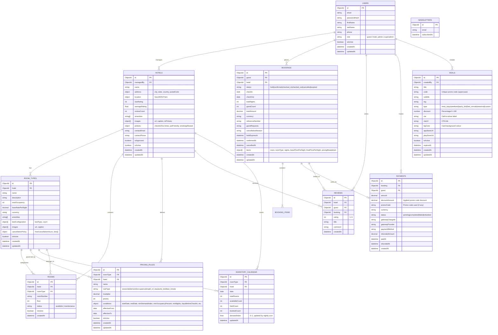

# ER Diagram — Yoyo Hotel Booking & Yield Pricing System

## Collections Overview

| Collection | Purpose |
|------------|---------|
| `users` | Guests, hotel admins, and the superadmin |
| `hotels` | Hotel listings (with approval workflow) |
| `roomtypes` | Room categories per hotel |
| `rooms` | Physical room entities |
| `inventorycalendars` | Per-day availability tracking per room type |
| `pricingrules` | DB-driven rules for the yield pricing engine |
| `bookings` | Booking state machine (hold → confirmed) |
| `payments` | Payment records linked to bookings |
| `reviews` | Guest reviews linked to hotels and bookings |
| `deals` | Promo codes / coupon deals created by superadmin |
| `newsletters` | Email subscriber list |

---

## Mermaid ER Diagram

---

## Key Relationships Explained

| Relationship | Cardinality | Notes |
|---|---|---|
| User → Hotels | 1..* | A `hotel_admin` manages multiple hotels |
| Hotel → RoomTypes | 1..* | Each hotel has at least one room type |
| RoomType → InventoryCalendar | 1 per day | One document per `(roomType, date)` pair |
| RoomType → PricingRules | 0..* | Rules drive the YieldPricingEngine multipliers |
| Booking → Payment | 1..1 | Each confirmed booking has one payment record |
| Payment → Deals | via `promoCode` field | Code validated against `DEALS.code` at payment time |
| User → Deals | superadmin creates | Only `superadmin` role can create/update/delete deals |
