# Class Diagram — Yoyo Hotel Booking & Yield Pricing System

## Mermaid Class Diagram

```mermaid
classDiagram

    class User {
        +String id
        +String email
        +String passwordHash
        +String firstName
        +String lastName
        +String phone
        +String role
        +Boolean isActive
        +getFullName() String
        +isAdmin() Boolean
        +validatePassword(plain) Boolean
    }

    class Hotel {
        +String id
        +String name
        +Object address
        +Object location
        +Int starRating
        +Float averageRating
        +Boolean isApproved
        +Boolean isActive
        +Object policies
        +getRoomTypes() RoomType[]
        +isOperational() Boolean
    }

    class RoomType {
        +String id
        +String hotelId
        +String name
        +Int maxOccupancy
        +Decimal baseRatePerNight
        +String[] amenities
        +Object cancellationPolicy
        +Boolean isActive
        +getBaseRate() Decimal
        +supportsOccupancy(guests) Boolean
    }

    class Room {
        +String id
        +String hotelId
        +String roomTypeId
        +String roomNumber
        +Int floor
        +String status
        +Boolean isActive
        +isAvailable(checkIn, checkOut) Boolean
    }

    class InventoryCalendar {
        +String id
        +String roomTypeId
        +String hotelId
        +Date date
        +Int totalRooms
        +Int availableCount
        +Int heldCount
        +Int bookedCount
        +Float demandIndex
        +getOccupancyPercent() Float
        +isAvailable() Boolean
    }

    class Booking {
        +String id
        +String guestId
        +String hotelId
        +String status
        +Date checkIn
        +Date checkOut
        +Int totalNights
        +Decimal totalAmount
        +DateTime holdExpiresAt
        +Array items
        +transitionTo(newStatus) void
        +isHoldExpired() Boolean
        +canBeCancelled() Boolean
    }

    class Payment {
        +String id
        +String bookingId
        +String guestId
        +Decimal amount
        +Decimal discountAmount
        +String promoCode
        +String currency
        +String status
        +String gatewayChargeId
        +String paymentMethod
        +DateTime paidAt
        +isCompleted() Boolean
    }

    class PricingRule {
        +String id
        +String roomTypeId
        +String hotelId
        +String name
        +String ruleType
        +Decimal multiplier
        +Int priority
        +Object conditions
        +Date effectiveFrom
        +Date effectiveTo
        +Boolean isActive
    }

    class Deal {
        +String id
        +String title
        +String code
        +String subtitle
        +String tag
        +String type
        +Number discount
        +String cta
        +String ctaUrl
        +String bgColor
        +Boolean isActive
        +DateTime expiresAt
        +String createdBy
        +isValid() Boolean
    }

    class Newsletter {
        +String id
        +String email
        +DateTime subscribedAt
    }

    class PricingStrategy {
        <<abstract>>
        #PricingRule rule
        +apply(context) Number
        +getName() String
        +getPriority() Int
    }

    class SeasonalPricing {
        +apply(context) Number
        +getName() String
        +getPriority() Int
    }

    class DemandPricing {
        +apply(context) Number
        +getName() String
        +getPriority() Int
    }

    class OccupancyPricing {
        +apply(context) Number
        +getName() String
        +getPriority() Int
    }

    class LengthOfStayDiscount {
        +apply(context) Number
        +getName() String
        +getPriority() Int
    }

    class EarlyBirdPricing {
        +apply(context) Number
        +getName() String
        +getPriority() Int
    }

    class LastMinutePricing {
        +apply(context) Number
        +getName() String
        +getPriority() Int
    }

    class PricingStrategyFactory {
        <<static>>
        -Map STRATEGY_MAP
        +create(rule) PricingStrategy
        +getSupportedTypes() String[]
    }

    class YieldPricingEngine {
        -PricingStrategy[] strategies
        +loadStrategies(roomTypeId, checkIn) void
        +applyStrategies(baseRate, context) Object
        +computePrice(roomTypeId, checkIn, checkOut) PricingResult
    }

    class AvailabilityService {
        +checkAvailability(roomTypeId, checkIn, checkOut) Boolean
        +reserveRoom(roomTypeId, checkIn, checkOut) Room
        +releaseRoom(roomId, checkIn, checkOut) void
    }

    class NotificationService {
        <<EventEmitter>>
        +emit(event, payload) void
        +on(event, handler) void
        +sendConfirmationEmail(guest) void
        +sendCancellationEmail(guest) void
    }

    %% Strategy hierarchy
    PricingStrategy <|-- SeasonalPricing       : extends
    PricingStrategy <|-- DemandPricing         : extends
    PricingStrategy <|-- OccupancyPricing      : extends
    PricingStrategy <|-- LengthOfStayDiscount  : extends
    PricingStrategy <|-- EarlyBirdPricing      : extends
    PricingStrategy <|-- LastMinutePricing     : extends

    %% Engine wiring
    PricingStrategyFactory ..> PricingStrategy : creates
    YieldPricingEngine --> PricingStrategyFactory : uses
    YieldPricingEngine o-- PricingStrategy : composes

    %% Domain relationships
    User "1" --> "0..*" Booking       : places
    User "1" --> "0..*" Deal          : creates
    Hotel "1" *-- "1..*" RoomType     : has
    Hotel "1" *-- "0..*" Room         : owns
    RoomType "1" *-- "0..*" Room      : categorizes
    RoomType "1" *-- "0..*" InventoryCalendar : tracks
    RoomType "1" *-- "0..*" PricingRule       : governed_by
    Booking "1" --> "1" Payment       : paid_via
    Booking "1" *-- "1..*" BookingItem : contains
    Payment "0..1" --> "1" Deal       : uses_promo
```

---

## Pattern Summary

| Pattern | Classes Involved | Description |
|---------|-----------------|-------------|
| **Strategy** | `PricingStrategy` + 6 subclasses | Interchangeable multiplier behaviours |
| **Factory** | `PricingStrategyFactory` | Instantiates correct strategy from `ruleType` string |
| **Composition** | `YieldPricingEngine` | Chains strategies: `finalPrice = base × ∏(multipliers)` |
| **State Machine** | `Booking.transitionTo()` | Guards valid transitions (hold→confirmed, etc.) |
| **Observer** | `NotificationService` (EventEmitter) | Decouples booking events from email side-effects |
| **Service Layer** | `AvailabilityService`, `YieldPricingEngine` | Encapsulate complex business logic away from controllers |
