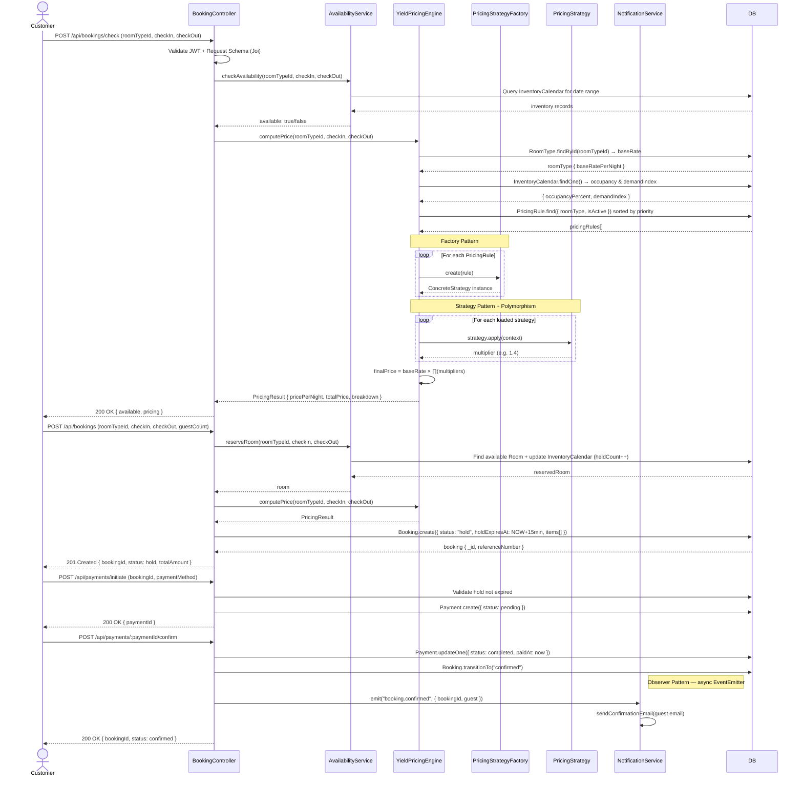
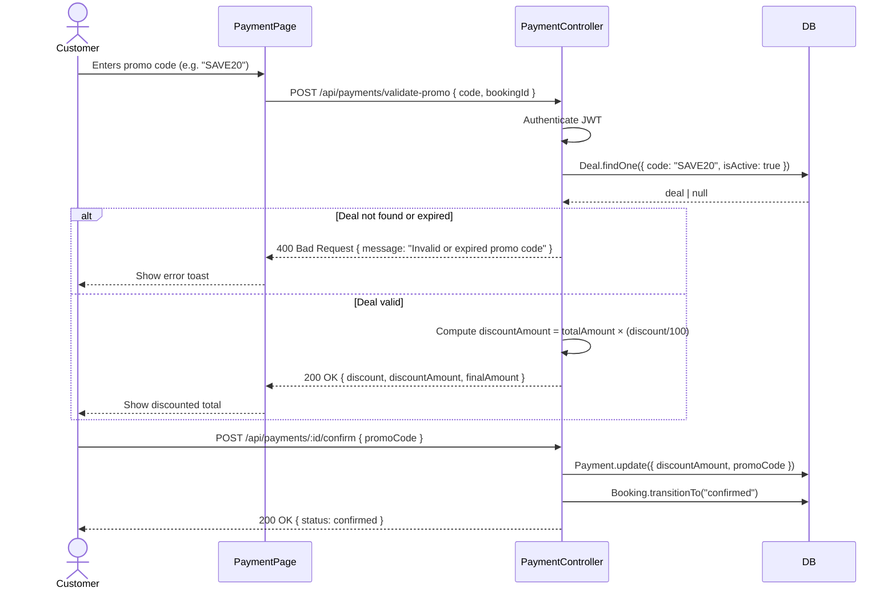
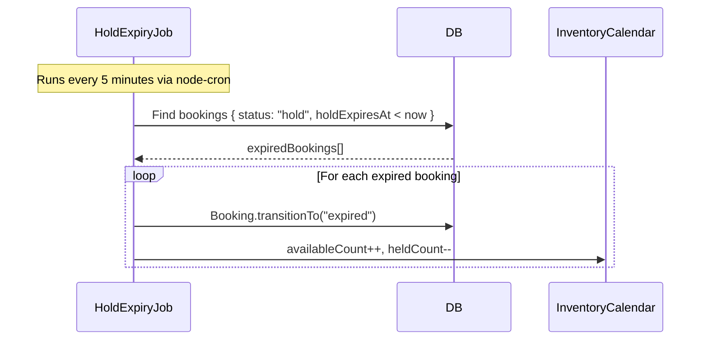
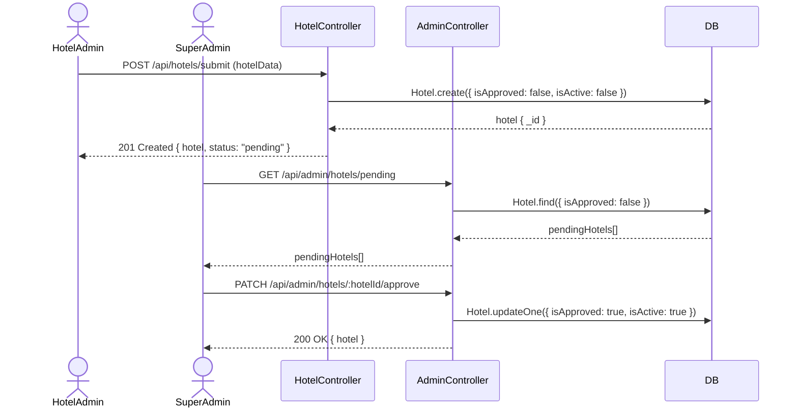

# Sequence Diagram — Yoyo Hotel Booking & Yield Pricing System

## 1. Main Booking Flow (Check → Hold → Payment → Confirmed)

---

## 2. Promo Code Validation Flow

---

## 3. Hold Expiry Background Job

---

## 4. Hotel Approval Flow (Hotel Admin → SuperAdmin)

