# Use Case Diagram — Yoyo Hotel Booking & Yield Pricing System

## Actors

| Actor | Description |
|-------|-------------|
| Guest | Searches, reserves, and manages hotel room bookings; applies promo codes |
| Hotel Admin | Lists hotels, manages room types and pricing rules |
| Super Admin | Approves hotels, manages all users/roles, creates deals & promo codes |
| Scheduler System | Runs automated background jobs (node-cron) |
| Notification System | Sends emails via Observer pattern (EventEmitter) |

---

## Mermaid Use Case Diagram

```mermaid
graph TD
    Guest([" Guest"])
    HotelAdmin([" Hotel Admin"])
    SuperAdmin([" Super Admin"])
    Scheduler(["⏰ Scheduler System"])
    Notifier([" Notification System"])

    subgraph "Authentication"
        UC_REG["Register Account"]
        UC_LOGIN["Login (JWT)"]
        UC_PROFILE["View & Edit Profile"]
        UC_CHGPWD["Change Password"]
    end

    subgraph "Hotel Discovery"
        UC_SEARCH["Search Hotels (city, name)"]
        UC_FILTER["Filter by Stars / Rating"]
        UC_CITY["Browse by City"]
        UC_DETAIL["View Hotel Detail"]
        UC_REVIEWS["View Reviews"]
    end

    subgraph "Booking Flow"
        UC_AVAIL["Check Room Availability"]
        UC_PRICE["Get Dynamic Yield Price"]
        UC_HOLD["Create Booking (HOLD)"]
        UC_PROMO["Apply Promo Code"]
        UC_PAY["Confirm Payment"]
        UC_CONFIRM["Booking Confirmed"]
        UC_CANCEL["Cancel Booking"]
        UC_MYBOOKINGS["View My Bookings"]
    end

    subgraph "Reviews"
        UC_WRITEREVIEW["Write Review"]
    end

    subgraph "Newsletter"
        UC_SUBSCRIBE["Subscribe to Newsletter"]
        UC_UNSUBSCRIBE["Unsubscribe from Newsletter"]
    end

    subgraph "Hotel Admin Panel"
        UC_LISTHOTEL["List My Hotel (pending approval)"]
        UC_MANAGE_ROOMS["Manage Room Types"]
        UC_PRICING_RULES["Configure Pricing Rules"]
        UC_VIEW_BOOKINGS_ADMIN["View Hotel Bookings"]
    end

    subgraph "Super Admin Dashboard"
        UC_APPROVE["Approve / Reject Hotels"]
        UC_MANAGE_USERS["Manage Users & Roles"]
        UC_VIEW_ALL["View All Bookings & Hotels"]
        UC_MANAGE_DEALS["Create & Manage Deals / Promo Codes"]
        UC_MANAGE_REVIEWS["Moderate Reviews"]
        UC_VIEW_SUBSCRIBERS["View Newsletter Subscribers"]
        UC_ANALYTICS["View Platform Analytics"]
    end

    subgraph "Background Jobs"
        UC_HOLD_EXPIRY["Release Expired Holds"]
        UC_RESTORE_INV["Restore Inventory on Expiry"]
    end

    subgraph "Notifications"
        UC_NOTIF_CONFIRM["Send Booking Confirmation Email"]
        UC_NOTIF_CANCEL["Send Cancellation Alert"]
    end

    %% Guest connections
    Guest --> UC_REG
    Guest --> UC_LOGIN
    Guest --> UC_PROFILE
    Guest --> UC_CHGPWD
    Guest --> UC_SEARCH
    Guest --> UC_FILTER
    Guest --> UC_CITY
    Guest --> UC_DETAIL
    Guest --> UC_REVIEWS
    Guest --> UC_AVAIL
    Guest --> UC_PRICE
    Guest --> UC_HOLD
    Guest --> UC_PROMO
    Guest --> UC_PAY
    Guest --> UC_CANCEL
    Guest --> UC_MYBOOKINGS
    Guest --> UC_WRITEREVIEW
    Guest --> UC_SUBSCRIBE
    Guest --> UC_UNSUBSCRIBE

    %% Hotel Admin connections
    HotelAdmin --> UC_LOGIN
    HotelAdmin --> UC_LISTHOTEL
    HotelAdmin --> UC_MANAGE_ROOMS
    HotelAdmin --> UC_PRICING_RULES
    HotelAdmin --> UC_VIEW_BOOKINGS_ADMIN

    %% Super Admin connections
    SuperAdmin --> UC_APPROVE
    SuperAdmin --> UC_MANAGE_USERS
    SuperAdmin --> UC_VIEW_ALL
    SuperAdmin --> UC_MANAGE_DEALS
    SuperAdmin --> UC_MANAGE_REVIEWS
    SuperAdmin --> UC_VIEW_SUBSCRIBERS
    SuperAdmin --> UC_ANALYTICS

    %% Scheduler connections
    Scheduler --> UC_HOLD_EXPIRY
    UC_HOLD_EXPIRY --> UC_RESTORE_INV

    %% Flow dependencies
    UC_PAY --> UC_CONFIRM
    UC_HOLD --> UC_AVAIL
    UC_PRICE --> UC_AVAIL
    UC_PROMO --> UC_PAY

    %% Notification triggers
    UC_CONFIRM --> UC_NOTIF_CONFIRM
    UC_CANCEL --> UC_NOTIF_CANCEL
    Notifier --> UC_NOTIF_CONFIRM
    Notifier --> UC_NOTIF_CANCEL
```

---

## Use Case Descriptions

| Use Case | Actor | Description | Status |
|----------|-------|-------------|--------|
| Register Account | Guest | Email + password signup with role selection | ✅ |
| Login (JWT) | All | Stateless JWT authentication | ✅ |
| View & Edit Profile | All | Update name, phone, avatar URL | ✅ |
| Change Password | All | Authenticated password update | ✅ |
| Search Hotels | Guest | Full-text search by city or hotel name | ✅ |
| Filter by Stars / Rating | Guest | Query-param based filtering on listing page | ✅ |
| Browse by City | Guest | City pill navigation on homepage | ✅ |
| View Hotel Detail | Guest | Images, amenities, room types, reviews | ✅ |
| View Reviews | Guest | Public reviews with ratings per hotel | ✅ |
| Check Room Availability | Guest | Queries InventoryCalendar for date range | ✅ |
| Get Dynamic Yield Price | Guest | YieldPricingEngine applies strategy chain | ✅ |
| Create Booking (HOLD) | Guest | 15-min HOLD with inventory decrement | ✅ |
| Apply Promo Code | Guest | Validates deal code → discount applied at payment | ✅ |
| Confirm Payment | Guest | Records payment, transitions booking to confirmed | ✅ |
| Cancel Booking | Guest | State transition + inventory restore | ✅ |
| View My Bookings | Guest | Full booking history with status badges | ✅ |
| Write Review | Guest | Rating + comment linked to a completed booking | ✅ |
| Subscribe to Newsletter | Guest | Email subscription via public endpoint | ✅ |
| Unsubscribe from Newsletter | Guest | Email unsubscription via public endpoint | ✅ |
| List My Hotel | Hotel Admin | Submit hotel for superadmin approval | ✅ |
| Manage Room Types | Hotel Admin | Create/edit/delete room types and rates | ✅ |
| Configure Pricing Rules | Hotel Admin | Set seasonal/demand/occupancy multiplier rules | ✅ |
| View Hotel Bookings | Hotel Admin | Scoped view of bookings for their hotel | ✅ |
| Approve / Reject Hotels | Super Admin | Toggle `isApproved` flag on pending hotels | ✅ |
| Manage Users & Roles | Super Admin | Change roles, deactivate/reactivate accounts | ✅ |
| View All Bookings & Hotels | Super Admin | Platform-wide admin views | ✅ |
| Create & Manage Deals | Super Admin | CRUD for deals with promo codes, discount %, expiry | ✅ |
| Moderate Reviews | Super Admin | Delete inappropriate reviews | ✅ |
| View Newsletter Subscribers | Super Admin | List all subscribed emails | ✅ |
| View Platform Analytics | Super Admin | Dashboard stats: bookings, revenue, users | ✅ |
| Release Expired Holds | Scheduler | Cron job every 5 min — expires stale HOLD bookings | ✅ |
| Restore Inventory on Expiry | Scheduler | `availableCount++`, `heldCount--` per expired booking | ✅ |
| Send Confirmation Email | Notifier | Async EventEmitter notification on booking confirmed | ✅ |
| Send Cancellation Alert | Notifier | Async EventEmitter notification on booking cancelled | ✅ |
