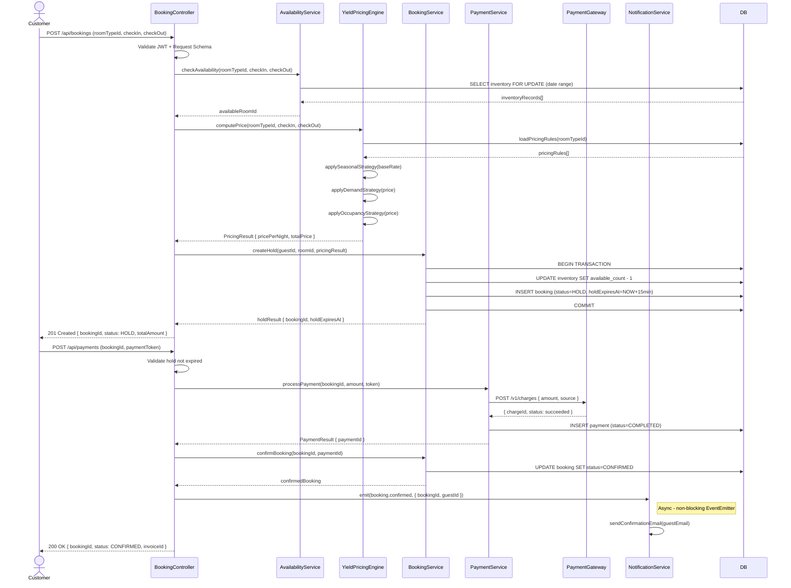

# Sequence Diagram — Hotel Room Booking & Yield Pricing System

## Main Booking Flow

```mermaid
sequenceDiagram
    actor Customer
    participant BookingController
    participant AvailabilityService
    participant YieldPricingEngine
    participant BookingService
    participant PaymentService
    participant PaymentGateway
    participant NotificationService
    participant DB

    Customer->>BookingController: POST /api/bookings (roomTypeId, checkIn, checkOut)
    BookingController->>BookingController: Validate JWT + Request Schema

    BookingController->>AvailabilityService: checkAvailability(roomTypeId, checkIn, checkOut)
    AvailabilityService->>DB: SELECT inventory FOR UPDATE (date range)
    DB-->>AvailabilityService: inventoryRecords[]
    AvailabilityService-->>BookingController: availableRoomId

    BookingController->>YieldPricingEngine: computePrice(roomTypeId, checkIn, checkOut)
    YieldPricingEngine->>DB: loadPricingRules(roomTypeId)
    DB-->>YieldPricingEngine: pricingRules[]
    YieldPricingEngine->>YieldPricingEngine: applySeasonalStrategy(baseRate)
    YieldPricingEngine->>YieldPricingEngine: applyDemandStrategy(price)
    YieldPricingEngine->>YieldPricingEngine: applyOccupancyStrategy(price)
    YieldPricingEngine-->>BookingController: PricingResult { pricePerNight, totalPrice }

    BookingController->>BookingService: createHold(guestId, roomId, pricingResult)
    BookingService->>DB: BEGIN TRANSACTION
    BookingService->>DB: UPDATE inventory SET available_count - 1
    BookingService->>DB: INSERT booking (status=HOLD, holdExpiresAt=NOW+15min)
    BookingService->>DB: COMMIT
    BookingService-->>BookingController: holdResult { bookingId, holdExpiresAt }
    BookingController-->>Customer: 201 Created { bookingId, status: HOLD, totalAmount }

    Customer->>BookingController: POST /api/payments (bookingId, paymentToken)
    BookingController->>BookingController: Validate hold not expired

    BookingController->>PaymentService: processPayment(bookingId, amount, token)
    PaymentService->>PaymentGateway: POST /v1/charges { amount, source }
    PaymentGateway-->>PaymentService: { chargeId, status: succeeded }
    PaymentService->>DB: INSERT payment (status=COMPLETED)
    PaymentService-->>BookingController: PaymentResult { paymentId }

    BookingController->>BookingService: confirmBooking(bookingId, paymentId)
    BookingService->>DB: UPDATE booking SET status=CONFIRMED
    BookingService-->>BookingController: confirmedBooking

    BookingController->>NotificationService: emit(booking.confirmed, { bookingId, guestId })
    Note right of NotificationService: Async - non-blocking EventEmitter
    NotificationService->>NotificationService: sendConfirmationEmail(guestEmail)

    BookingController-->>Customer: 200 OK { bookingId, status: CONFIRMED, invoiceId }
```
