# 📄 sequenceDiagram.md — Hotel Room Booking & Yield Pricing System

---

## 1. Main Booking Flow Overview

This sequence diagram captures the **complete end-to-end booking flow** from the moment a guest submits a booking request to final confirmation. It includes:

- Input validation at the controller layer
- Real-time availability checking
- Dynamic yield pricing computation (multi-strategy)
- Temporary hold creation with inventory deduction
- Payment processing via external gateway
- Booking confirmation and persistence
- Asynchronous notification dispatch

### Participants

| Participant | Role |
|-------------|------|
| `Client` | React frontend / API consumer |
| `BookingController` | HTTP request handler; validates input; delegates to services |
| `AvailabilityService` | Checks room availability across date range; manages holds |
| `YieldPricingEngine` | Orchestrates pricing strategies; computes final room rate |
| `PricingStrategyFactory` | Creates strategy instances from DB-loaded pricing rules |
| `SeasonalStrategy` | Applies seasonal multiplier |
| `DemandStrategy` | Applies demand-based multiplier |
| `OccupancyStrategy` | Applies occupancy-threshold multiplier |
| `BookingService` | Core booking orchestration; manages state transitions |
| `CancellationPolicyService` | Loads and evaluates cancellation policies |
| `PaymentService` | Abstracts payment gateway calls |
| `PaymentGateway` | External payment processor (Stripe/Razorpay) |
| `BookingRepository` | Persists booking records to DB |
| `InventoryRepository` | Reads/writes `room_inventory_daily` table |
| `InvoiceService` | Generates itemized invoice after payment |
| `NotificationService` | Dispatches email/SMS notifications (async via EventEmitter) |

---

## 2. PlantUML Sequence Diagram — Full Booking Flow with Yield Pricing

```plantuml
@startuml Hotel_Booking_SequenceDiagram

skinparam sequenceMessageAlign center
skinparam responseMessageBelowArrow true
skinparam maxMessageSize 200
skinparam sequenceGroupBackgroundColor LightYellow
skinparam sequenceGroupBorderColor DarkOrange
skinparam participantBackgroundColor LightBlue
skinparam participantBorderColor SteelBlue
skinparam noteBorderColor DarkOrange
skinparam noteBackgroundColor LightYellow

actor "Guest (Client)" as Client

box "API Layer" #LightCyan
  participant "BookingController" as BC
end box

box "Service Layer" #LightGreen
  participant "AvailabilityService" as AS
  participant "YieldPricingEngine" as YPE
  participant "PricingStrategyFactory" as PSF
  participant "SeasonalStrategy" as SS
  participant "DemandStrategy" as DS
  participant "OccupancyStrategy" as OS
  participant "BookingService" as BS
  participant "PaymentService" as PS
  participant "InvoiceService" as IS
  participant "NotificationService" as NS
end box

box "Repository Layer" #LightYellow
  participant "InventoryRepository" as IR
  participant "BookingRepository" as BR
  participant "PricingRuleRepository" as PRR
end box

box "External Systems" #MistyRose
  participant "PaymentGateway" as PGW
end box

' ═══════════════════════════════════════════════════════
' PHASE 1: REQUEST VALIDATION
' ═══════════════════════════════════════════════════════
group Phase 1: Request Validation & Auth Check
  Client -> BC : POST /api/bookings\n{ hotelId, roomTypeId, checkIn, checkOut, guests, addOns[] }
  activate BC

  BC -> BC : validateJWT(token)
  BC -> BC : validateRequestSchema(body)\n[Joi/Zod validation]

  alt Validation Failed
    BC --> Client : 400 Bad Request\n{ error: "Invalid input" }
  end
end

' ═══════════════════════════════════════════════════════
' PHASE 2: AVAILABILITY CHECK
' ═══════════════════════════════════════════════════════
group Phase 2: Real-Time Availability Check
  BC -> AS : checkAvailability(roomTypeId, checkIn, checkOut, guestCount)
  activate AS

  AS -> IR : queryInventory(roomTypeId, checkIn, checkOut)
  activate IR
  note right of IR
    SQL: SELECT room_id, available_count
    FROM room_inventory_daily
    WHERE room_type_id = ? 
      AND date BETWEEN ? AND ?
      AND available_count > 0
    FOR UPDATE  ← optimistic lock
  end note
  IR --> AS : inventoryRecords[]
  deactivate IR

  AS -> AS : validateAllDatesAvailable(inventoryRecords, checkIn, checkOut)

  alt No Availability
    AS --> BC : AvailabilityException("No rooms available")
    BC --> Client : 409 Conflict\n{ error: "No rooms available for selected dates" }
    deactivate AS
  end

  AS -> AS : selectBestAvailableRoom(inventoryRecords)
  AS --> BC : { roomId, availableRoomId }
  deactivate AS
end

' ═══════════════════════════════════════════════════════
' PHASE 3: YIELD PRICING COMPUTATION
' ═══════════════════════════════════════════════════════
group Phase 3: Dynamic Yield Pricing Computation
  BC -> YPE : computePrice(roomTypeId, checkIn, checkOut, occupancyContext)
  activate YPE

  YPE -> PRR : loadActivePricingRules(roomTypeId, checkIn, checkOut)
  activate PRR
  note right of PRR
    SELECT * FROM pricing_rules
    WHERE room_type_id = ?
      AND effective_from <= checkIn
      AND effective_to >= checkOut
      AND is_active = true
    ORDER BY priority ASC
  end note
  PRR --> YPE : pricingRules[]
  deactivate PRR

  YPE -> PRR : loadBaseRate(roomTypeId)
  PRR --> YPE : baseRate (e.g., ₹5000/night)

  YPE -> PSF : createStrategies(pricingRules[])
  activate PSF
  PSF -> PSF : instantiate SeasonalStrategy(rule)
  PSF -> PSF : instantiate DemandStrategy(rule)
  PSF -> PSF : instantiate OccupancyStrategy(rule)
  PSF --> YPE : strategies[]
  deactivate PSF

  note over YPE : finalPrice = baseRate\nApply each strategy in priority order

  YPE -> SS : apply(pricingContext{ dates, baseRate })
  activate SS
  SS -> SS : checkDateInSeason(checkIn, checkOut)
  SS -> SS : return baseRate × seasonMultiplier
  note right of SS : e.g., Christmas peak:\nbaseRate × 1.4 = ₹7000
  SS --> YPE : adjustedPrice (₹7000)
  deactivate SS

  YPE -> DS : apply(pricingContext{ dates, currentPrice })
  activate DS
  DS -> DS : computeDemandIndex(checkIn, checkOut)
  note right of DS
    Demand index = bookings in last 7 days
    for target dates / historical avg
    High demand (>1.2): multiplier = 1.2
  end note
  DS --> YPE : adjustedPrice (₹8400)
  deactivate DS

  YPE -> OS : apply(pricingContext{ roomTypeId, dates, currentPrice })
  activate OS
  OS -> IR : getOccupancyRate(roomTypeId, checkIn, checkOut)
  IR --> OS : occupancyRate (85%)
  OS -> OS : if occupancyRate > 80%: multiplier = 1.15
  OS --> YPE : adjustedPrice (₹9660)
  deactivate OS

  YPE -> YPE : applyLengthOfStayDiscount(nights, currentPrice)
  note right of YPE : 3 nights: no discount\nfinalPrice = ₹9660/night\ntotalPrice = ₹28,980
  YPE --> BC : PricingResult{ pricePerNight: 9660, totalPrice: 28980, breakdown: {...} }
  deactivate YPE
end

' ═══════════════════════════════════════════════════════
' PHASE 4: HOLD CREATION
' ═══════════════════════════════════════════════════════
group Phase 4: Temporary Hold Creation (15-min TTL)
  BC -> BS : createHold(guestId, roomId, checkIn, checkOut, pricingResult, addOns[])
  activate BS

  BS -> BR : beginTransaction()

  BS -> IR : decrementInventory(roomId, checkIn, checkOut)
  activate IR
  note right of IR
    UPDATE room_inventory_daily
    SET available_count = available_count - 1
    WHERE room_id = ? AND date BETWEEN ? AND ?
    AND available_count > 0  ← prevents race condition
  end note
  IR --> BS : rowsAffected (must equal nights count)
  deactivate IR

  alt Race Condition: Inventory Already Taken
    BS -> BR : rollbackTransaction()
    BS --> BC : ConcurrencyException("Room just booked by another user")
    BC --> Client : 409 Conflict\n{ error: "Room no longer available, please retry" }
  end

  BS -> BR : insertBooking({ status: 'HOLD', holdExpiresAt: NOW()+15min, ... })
  activate BR
  BR --> BS : booking{ id: "BK-2024-001", status: 'HOLD' }
  deactivate BR

  BS -> BR : insertBookingItems(bookingId, roomId, nights, pricePerNight)
  BS -> BR : insertBookingAddOns(bookingId, addOns[])
  BS -> BR : commitTransaction()

  BS --> BC : holdResult{ bookingId, holdExpiresAt, totalAmount: 28980 }
  deactivate BS

  BC --> Client : 201 Created\n{ bookingId, status: "HOLD", totalAmount, holdExpiresAt, pricingBreakdown }
end

' ═══════════════════════════════════════════════════════
' PHASE 5: PAYMENT PROCESSING
' ═══════════════════════════════════════════════════════
group Phase 5: Payment Processing
  Client -> BC : POST /api/payments\n{ bookingId, paymentMethod, paymentToken }
  
  BC -> BS : getBooking(bookingId)
  BS -> BR : findById(bookingId)
  BR --> BS : booking{ status: 'HOLD', holdExpiresAt }
  BS --> BC : booking

  BC -> BC : validateHoldNotExpired(holdExpiresAt)

  alt Hold Expired
    BC --> Client : 410 Gone\n{ error: "Hold expired. Please restart booking." }
  end

  BC -> PS : processPayment(bookingId, amount, paymentToken, currency)
  activate PS

  PS -> PS : buildPaymentRequest(amount, currency, metadata)
  PS -> PGW : POST /v1/charges\n{ amount, currency, source: paymentToken, metadata }
  activate PGW
  note right of PGW : External: Stripe/Razorpay API
  PGW --> PS : PaymentResponse{ chargeId, status: 'succeeded', amount }
  deactivate PGW

  PS -> BR : insertPayment({ bookingId, chargeId, amount, status: 'COMPLETED' })
  PS --> BC : PaymentResult{ paymentId, chargeId, status: 'COMPLETED' }
  deactivate PS
end

' ═══════════════════════════════════════════════════════
' PHASE 6: BOOKING CONFIRMATION
' ═══════════════════════════════════════════════════════
group Phase 6: Booking Confirmation & State Transition
  BC -> BS : confirmBooking(bookingId, paymentId)
  activate BS

  BS -> BR : findById(bookingId)
  BR --> BS : booking{ status: 'HOLD' }

  BS -> BS : validateStateTransition('HOLD' → 'CONFIRMED')
  note right of BS
    State Machine:
    HOLD → CONFIRMED ✓ (valid)
    HOLD → CHECKED_IN ✗ (invalid, throws)
  end note

  BS -> BR : updateBookingStatus(bookingId, 'CONFIRMED', paymentId)
  activate BR
  BR --> BS : updatedBooking{ status: 'CONFIRMED' }
  deactivate BR

  BS --> BC : confirmedBooking
  deactivate BS
end

' ═══════════════════════════════════════════════════════
' PHASE 7: INVOICE GENERATION
' ═══════════════════════════════════════════════════════
group Phase 7: Invoice Generation
  BC -> IS : generateInvoice(bookingId)
  activate IS

  IS -> BR : getBookingWithItems(bookingId)
  BR --> IS : booking{ items[], addOns[], payment }

  IS -> IS : computeLineItems(items, addOns)
  IS -> IS : computeTaxes(subtotal)
  IS -> IS : buildInvoiceDocument()

  IS -> BR : insertInvoice({ bookingId, invoiceNumber, subtotal, taxes, total })
  IS --> BC : invoice{ invoiceId, invoiceNumber, downloadUrl }
  deactivate IS
end

' ═══════════════════════════════════════════════════════
' PHASE 8: ASYNC NOTIFICATION
' ═══════════════════════════════════════════════════════
group Phase 8: Asynchronous Notification Dispatch
  BC -> NS : emit('booking.confirmed', { bookingId, guestId, booking, invoice })
  note right of NS : EventEmitter — async, non-blocking\nBookingController does NOT await this
  activate NS
  NS -> NS : loadGuestContactDetails(guestId)
  NS -> NS : renderEmailTemplate('booking_confirmation', data)
  NS -> NS : sendEmail(guestEmail, subject, htmlBody)
  NS -> NS : logNotificationSent(bookingId, 'EMAIL', 'booking_confirmation')
  deactivate NS

  BC --> Client : 200 OK\n{ bookingId, status: "CONFIRMED", invoiceId, invoiceNumber,\n  checkIn, checkOut, totalAmount, pricingBreakdown }
  deactivate BC
end

' ═══════════════════════════════════════════════════════
' BACKGROUND: HOLD EXPIRY (Parallel Scheduler Flow)
' ═══════════════════════════════════════════════════════
group Background Job: Hold Expiry Scheduler (Every 5 min)
  participant "HoldExpiryJob\n(node-cron)" as HEJ
  
  HEJ -> BR : findExpiredHolds()\nWHERE status='HOLD' AND hold_expires_at < NOW()
  activate HEJ
  BR --> HEJ : expiredBookings[]

  loop for each expiredBooking
    HEJ -> BS : expireHold(bookingId)
    activate BS
    BS -> BR : updateStatus(bookingId, 'EXPIRED')
    BS -> IR : restoreInventory(roomId, checkIn, checkOut)
    BS -> NS : emit('booking.expired', { bookingId, guestId })
    deactivate BS
  end

  HEJ -> HEJ : logJobCompletion(processedCount)
  deactivate HEJ
end

@enduml
```

---

## 3. Sequence Flow Summary

| Phase | Key Action | Pattern Used |
|-------|-----------|--------------|
| 1. Validation | JWT auth + schema validation at controller | Guard Clause |
| 2. Availability | Per-day inventory query with `FOR UPDATE` lock | Optimistic Locking |
| 3. Pricing | Multi-strategy price computation | Strategy + Factory |
| 4. Hold | Atomic inventory decrement + booking insert | Unit of Work / Transaction |
| 5. Payment | Gateway abstraction; charge creation | Adapter Pattern |
| 6. Confirmation | State machine transition HOLD → CONFIRMED | State Pattern |
| 7. Invoice | Line-item computation + tax + PDF generation | Builder Pattern |
| 8. Notification | Async event emission; non-blocking | Observer/EventEmitter |
| BG. Hold Expiry | Scheduled job; restore inventory for expired holds | Scheduler + Command |
