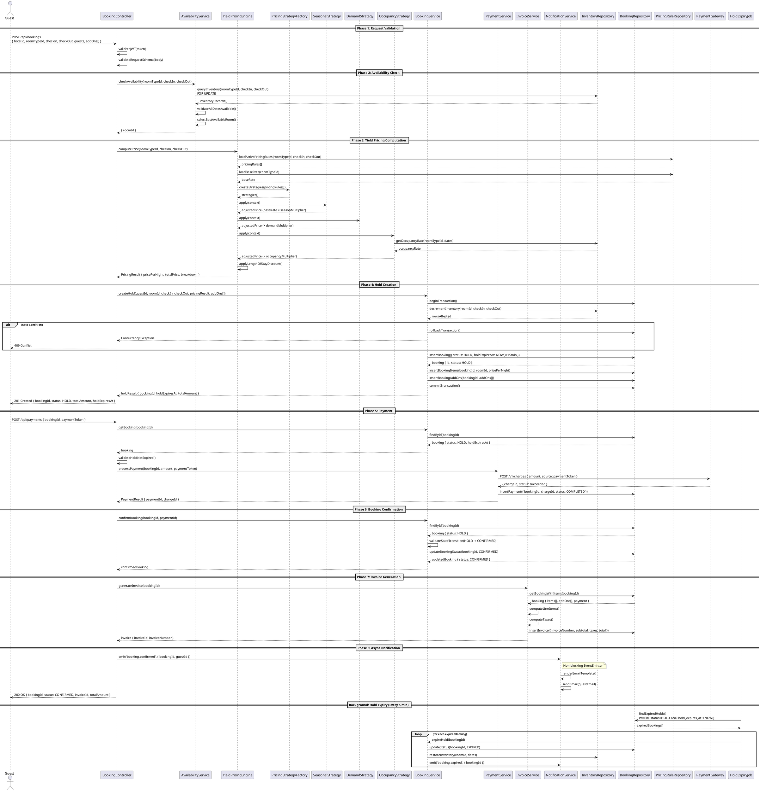

# Sequence Diagram — Hotel Room Booking & Yield Pricing System

## Main Booking Flow

End-to-end flow: Guest submits booking → availability check → yield pricing → hold → payment → confirmation → invoice → notification.

---

## PlantUML Sequence Diagram

---

## Flow Summary

| Phase | Action | Pattern |
|-------|--------|---------|
| 1 | JWT auth + schema validation | Guard Clause |
| 2 | Per-day inventory query with `FOR UPDATE` | Optimistic Locking |
| 3 | Multi-strategy price computation | Strategy + Factory |
| 4 | Atomic inventory decrement + booking insert | Unit of Work |
| 5 | Payment gateway abstraction | Adapter |
| 6 | State machine: HOLD → CONFIRMED | State Pattern |
| 7 | Line-item invoice generation | Builder |
| 8 | Async event notification | Observer |
| BG | Scheduled hold expiry + inventory restore | Scheduler |
