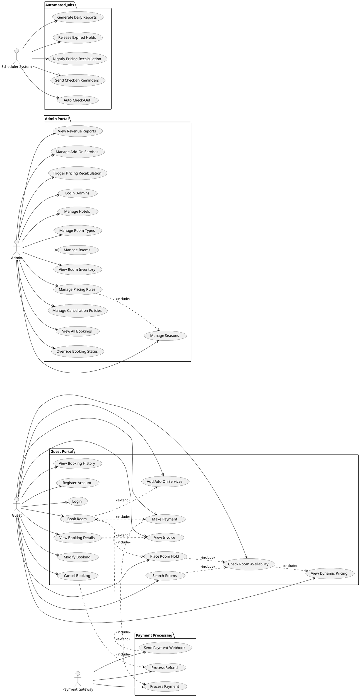

# Use Case Diagram — Hotel Room Booking & Yield Pricing System

## Actors

| Actor | Type | Description |
|-------|------|-------------|
| Guest | Primary | Searches, books, and manages reservations |
| Admin | Primary | Manages rooms, pricing rules, and inventory |
| Payment Gateway | External | Processes payments and refunds |
| Scheduler System | Automated | Runs background jobs (hold expiry, pricing, reminders) |

---

## Use Cases by Actor

### Guest
| ID | Use Case |
|----|----------|
| UC-G01 | Register Account |
| UC-G02 | Login |
| UC-G03 | Search Rooms |
| UC-G04 | Check Room Availability |
| UC-G05 | View Dynamic Pricing |
| UC-G06 | Place Room Hold |
| UC-G07 | Book Room |
| UC-G08 | Add Add-On Services |
| UC-G09 | Make Payment |
| UC-G10 | View Booking Details |
| UC-G11 | Modify Booking |
| UC-G12 | Cancel Booking |
| UC-G13 | View Invoice |
| UC-G14 | View Booking History |

### Admin
| ID | Use Case |
|----|----------|
| UC-A01 | Login (Admin) |
| UC-A02 | Manage Hotels |
| UC-A03 | Manage Room Types |
| UC-A04 | Manage Rooms |
| UC-A05 | View Room Inventory |
| UC-A06 | Manage Pricing Rules |
| UC-A07 | Manage Seasons |
| UC-A08 | Manage Cancellation Policies |
| UC-A09 | View All Bookings |
| UC-A10 | Override Booking Status |
| UC-A11 | View Revenue Reports |
| UC-A12 | Manage Add-On Services |
| UC-A13 | Trigger Pricing Recalculation |

### Payment Gateway
| ID | Use Case |
|----|----------|
| UC-P01 | Process Payment |
| UC-P02 | Process Refund |
| UC-P03 | Send Payment Webhook |

### Scheduler System
| ID | Use Case |
|----|----------|
| UC-S01 | Release Expired Holds |
| UC-S02 | Nightly Pricing Recalculation |
| UC-S03 | Send Check-In Reminders |
| UC-S04 | Auto Check-Out |
| UC-S05 | Generate Daily Reports |

---

## PlantUML Use Case Diagram

