# 📄 useCaseDiagram.md — Hotel Room Booking & Yield Pricing System

---

## 1. Actor Definitions

| Actor | Type | Description |
|-------|------|-------------|
| **Guest** | Primary | A registered or anonymous user who searches, books, and manages hotel reservations |
| **Admin** | Primary | Hotel staff/manager who manages rooms, pricing rules, seasons, and inventory |
| **Payment Gateway** | External System | Third-party payment processor (e.g., Stripe, Razorpay) that handles transactions and refunds |
| **Scheduler System** | Automated System | Background job runner (node-cron) that executes timed tasks like hold expiry and pricing recalculation |

---

## 2. Use Case List by Actor

### 🧳 Guest
| # | Use Case | Description |
|---|----------|-------------|
| UC-G01 | Register Account | Create a new guest account with email/password |
| UC-G02 | Login | Authenticate and receive JWT token |
| UC-G03 | Search Rooms | Search available rooms by hotel, dates, guests, room type |
| UC-G04 | Check Room Availability | View available rooms for selected date range |
| UC-G05 | View Dynamic Pricing | See real-time computed price for selected dates |
| UC-G06 | Place Room Hold | Temporarily reserve a room (15-min TTL) before payment |
| UC-G07 | Book Room | Create confirmed booking after successful payment |
| UC-G08 | Add Add-On Services | Attach breakfast, parking, spa to booking |
| UC-G09 | Make Payment | Submit payment details to complete booking |
| UC-G10 | View Booking Details | View booking summary, status, invoice |
| UC-G11 | Modify Booking | Change dates or room type (subject to policy) |
| UC-G12 | Cancel Booking | Cancel booking and trigger refund per cancellation policy |
| UC-G13 | View Invoice | Download/view itemized invoice for completed booking |
| UC-G14 | View Booking History | List all past and upcoming bookings |
| UC-G15 | Logout | Invalidate session |

### 🏨 Admin
| # | Use Case | Description |
|---|----------|-------------|
| UC-A01 | Login (Admin) | Authenticate with admin credentials |
| UC-A02 | Manage Hotels | Create, update, view hotel properties |
| UC-A03 | Manage Room Types | Define room categories (Standard, Deluxe, Suite) with base rates |
| UC-A04 | Manage Rooms | Add/update/deactivate individual rooms |
| UC-A05 | View Room Inventory | View daily inventory calendar per room type |
| UC-A06 | Manage Pricing Rules | Create/update/delete yield pricing rules (seasonal, demand, occupancy) |
| UC-A07 | Manage Seasons | Define peak/off-peak seasons with date ranges and multipliers |
| UC-A08 | Manage Cancellation Policies | Define refund tiers and free-cancellation windows |
| UC-A09 | View All Bookings | List and filter all bookings across the property |
| UC-A10 | Override Booking Status | Manually update booking state (e.g., mark as checked-in) |
| UC-A11 | View Revenue Reports | View occupancy rates, RevPAR, ADR metrics |
| UC-A12 | Manage Add-On Services | Create/update/deactivate add-on service offerings |
| UC-A13 | Trigger Manual Pricing Recalculation | Force re-run of pricing engine for specific dates |

### 💳 Payment Gateway
| # | Use Case | Description |
|---|----------|-------------|
| UC-P01 | Process Payment | Receive payment request; return success/failure |
| UC-P02 | Process Refund | Receive refund request on cancellation; return refund confirmation |
| UC-P03 | Send Payment Webhook | Notify system of async payment status updates |

### ⏰ Scheduler System
| # | Use Case | Description |
|---|----------|-------------|
| UC-S01 | Release Expired Holds | Every 5 min: find holds > 15 min old; cancel and restore inventory |
| UC-S02 | Nightly Pricing Recalculation | Every night: compute demand index; update pricing multipliers for next 30 days |
| UC-S03 | Send Check-In Reminders | 24 hours before check-in: send reminder notifications to guests |
| UC-S04 | Auto Check-Out | At midnight: auto-transition bookings past checkout date to CHECKED_OUT |
| UC-S05 | Generate Daily Reports | Nightly: aggregate occupancy and revenue data for admin dashboard |

---

## 3. PlantUML Use Case Diagram

```plantuml
@startuml Hotel_Room_Booking_UseCaseDiagram

skinparam actorStyle awesome
skinparam packageStyle rectangle
skinparam usecase {
  BackgroundColor LightYellow
  BorderColor DarkOrange
  ArrowColor DarkSlateGray
  ActorBorderColor DarkSlateGray
  ActorBackgroundColor LightBlue
}
skinparam packageBackgroundColor LightCyan
skinparam packageBorderColor SteelBlue

left to right direction

' ─────────────────────────────────────────
' ACTORS
' ─────────────────────────────────────────
actor "Guest" as Guest
actor "Admin" as Admin
actor "Payment\nGateway" as PayGW
actor "Scheduler\nSystem" as Scheduler

' ─────────────────────────────────────────
' GUEST USE CASES
' ─────────────────────────────────────────
package "Guest Portal" {
  usecase "Register Account" as UC_G01
  usecase "Login" as UC_G02
  usecase "Search Rooms" as UC_G03
  usecase "Check Room Availability" as UC_G04
  usecase "View Dynamic Pricing" as UC_G05
  usecase "Place Room Hold" as UC_G06
  usecase "Book Room" as UC_G07
  usecase "Add Add-On Services" as UC_G08
  usecase "Make Payment" as UC_G09
  usecase "View Booking Details" as UC_G10
  usecase "Modify Booking" as UC_G11
  usecase "Cancel Booking" as UC_G12
  usecase "View Invoice" as UC_G13
  usecase "View Booking History" as UC_G14
}

' ─────────────────────────────────────────
' ADMIN USE CASES
' ─────────────────────────────────────────
package "Admin Portal" {
  usecase "Login (Admin)" as UC_A01
  usecase "Manage Hotels" as UC_A02
  usecase "Manage Room Types" as UC_A03
  usecase "Manage Rooms" as UC_A04
  usecase "View Room Inventory" as UC_A05
  usecase "Manage Pricing Rules" as UC_A06
  usecase "Manage Seasons" as UC_A07
  usecase "Manage Cancellation Policies" as UC_A08
  usecase "View All Bookings" as UC_A09
  usecase "Override Booking Status" as UC_A10
  usecase "View Revenue Reports" as UC_A11
  usecase "Manage Add-On Services" as UC_A12
  usecase "Trigger Pricing Recalculation" as UC_A13
}

' ─────────────────────────────────────────
' PAYMENT GATEWAY USE CASES
' ─────────────────────────────────────────
package "Payment Processing" {
  usecase "Process Payment" as UC_P01
  usecase "Process Refund" as UC_P02
  usecase "Send Payment Webhook" as UC_P03
}

' ─────────────────────────────────────────
' SCHEDULER USE CASES
' ─────────────────────────────────────────
package "Automated Jobs" {
  usecase "Release Expired Holds" as UC_S01
  usecase "Nightly Pricing\nRecalculation" as UC_S02
  usecase "Send Check-In Reminders" as UC_S03
  usecase "Auto Check-Out" as UC_S04
  usecase "Generate Daily Reports" as UC_S05
}

' ─────────────────────────────────────────
' GUEST ASSOCIATIONS
' ─────────────────────────────────────────
Guest --> UC_G01
Guest --> UC_G02
Guest --> UC_G03
Guest --> UC_G04
Guest --> UC_G05
Guest --> UC_G06
Guest --> UC_G07
Guest --> UC_G08
Guest --> UC_G09
Guest --> UC_G10
Guest --> UC_G11
Guest --> UC_G12
Guest --> UC_G13
Guest --> UC_G14

' ─────────────────────────────────────────
' ADMIN ASSOCIATIONS
' ─────────────────────────────────────────
Admin --> UC_A01
Admin --> UC_A02
Admin --> UC_A03
Admin --> UC_A04
Admin --> UC_A05
Admin --> UC_A06
Admin --> UC_A07
Admin --> UC_A08
Admin --> UC_A09
Admin --> UC_A10
Admin --> UC_A11
Admin --> UC_A12
Admin --> UC_A13

' ─────────────────────────────────────────
' PAYMENT GATEWAY ASSOCIATIONS
' ─────────────────────────────────────────
PayGW --> UC_P01
PayGW --> UC_P02
PayGW --> UC_P03

' ─────────────────────────────────────────
' SCHEDULER ASSOCIATIONS
' ─────────────────────────────────────────
Scheduler --> UC_S01
Scheduler --> UC_S02
Scheduler --> UC_S03
Scheduler --> UC_S04
Scheduler --> UC_S05

' ─────────────────────────────────────────
' INCLUDE / EXTEND RELATIONSHIPS
' ─────────────────────────────────────────
UC_G03 ..> UC_G04 : <<include>>
UC_G04 ..> UC_G05 : <<include>>
UC_G06 ..> UC_G04 : <<include>>
UC_G07 ..> UC_G06 : <<include>>
UC_G07 ..> UC_G09 : <<include>>
UC_G07 ..> UC_G08 : <<extend>>
UC_G09 ..> UC_P01 : <<include>>
UC_G12 ..> UC_P02 : <<include>>
UC_G10 ..> UC_G13 : <<extend>>
UC_P03 ..> UC_G07 : <<extend>>
UC_A06 ..> UC_A07 : <<include>>
UC_A13 ..> UC_S02 : <<extend>>

@enduml
```

---

## 4. Key Use Case Descriptions

### UC-G06: Place Room Hold
**Precondition**: Room is available for selected dates  
**Main Flow**:
1. Guest selects room and dates
2. System checks availability (UC-G04)
3. System computes dynamic price (UC-G05)
4. System creates a HOLD record with 15-minute TTL
5. System decrements available inventory in `room_inventory_daily`
6. System returns hold ID and price to guest  
**Postcondition**: Room is temporarily reserved; inventory decremented  
**Exception**: If room becomes unavailable between check and hold, return conflict error

### UC-S01: Release Expired Holds
**Trigger**: Scheduled every 5 minutes by node-cron  
**Main Flow**:
1. Query all bookings in HOLD state where `hold_expires_at < NOW()`
2. For each expired hold: transition state to EXPIRED
3. Restore inventory in `room_inventory_daily` for affected dates
4. Log expiry event  
**Postcondition**: Inventory restored; rooms available for new bookings

### UC-G12: Cancel Booking
**Precondition**: Booking exists in CONFIRMED or PENDING_PAYMENT state  
**Main Flow**:
1. Guest requests cancellation
2. System loads applicable `CancellationPolicy`
3. System computes refund amount based on days until check-in
4. System transitions booking to CANCELLED state
5. System initiates refund via Payment Gateway (UC-P02)
6. System restores inventory for cancelled dates
7. System sends cancellation confirmation notification  
**Postcondition**: Booking cancelled; refund initiated; inventory restored
