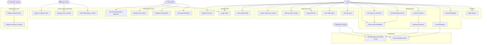

# Use Case Diagram — Hotel Room Booking & Yield Pricing System

## Actors

| Actor | Description |
|-------|-------------|
| Guest | Searches, reserves, and manages hotel room bookings |
| Hotel Admin | Lists hotels, manages room types and pricing rules |
| Super Admin | Approves hotels, manages all users and roles |
| Scheduler System | Runs automated background jobs (node-cron) |
| Notification System | Sends emails via Observer pattern (EventEmitter) |

---

## Mermaid Use Case Diagram

```mermaid
graph TD
    Guest(["👤 Guest"])
    HotelAdmin(["🏨 Hotel Admin"])
    SuperAdmin(["🛡️ Super Admin"])
    Scheduler(["⏰ Scheduler System"])
    Notifier(["🔔 Notification System"])

    subgraph "Authentication"
        UC_REG["Register Account"]
        UC_LOGIN["Login (JWT)"]
        UC_PROFILE["View & Edit Profile"]
    end

    subgraph "Hotel Discovery"
        UC_SEARCH["Search Hotels (city, name)"]
        UC_FILTER["Filter by Stars / Rating"]
        UC_CITY["Browse by City"]
        UC_DETAIL["View Hotel Detail"]
        UC_REVIEWS["View Reviews"]
    end

    subgraph "Booking Flow"
        UC_AVAIL["Check Room Availability"]
        UC_PRICE["Get Dynamic Yield Price"]
        UC_HOLD["Create Booking (HOLD)"]
        UC_PAY["Confirm Payment"]
        UC_CONFIRM["Booking Confirmed"]
        UC_CANCEL["Cancel Booking"]
        UC_MYBOOKINGS["View My Bookings"]
    end

    subgraph "Reviews"
        UC_WRITEREVIEW["Write Review"]
    end

    subgraph "Hotel Admin Panel"
        UC_LISTHOTEL["List My Hotel (pending approval)"]
        UC_MANAGE_ROOMS["Manage Room Types"]
        UC_PRICING_RULES["Configure Pricing Rules"]
        UC_VIEW_BOOKINGS_ADMIN["View Hotel Bookings"]
    end

    subgraph "Super Admin Dashboard"
        UC_APPROVE["Approve / Reject Hotels"]
        UC_MANAGE_USERS["Manage Users & Roles"]
        UC_VIEW_ALL["View All Bookings & Hotels"]
    end

    subgraph "Background Jobs"
        UC_HOLD_EXPIRY["Release Expired Holds"]
        UC_RESTORE_INV["Restore Inventory on Expiry"]
    end

    subgraph "Notifications"
        UC_NOTIF_CONFIRM["Send Booking Confirmation Email"]
        UC_NOTIF_CANCEL["Send Cancellation Alert"]
    end

    Guest --> UC_REG
    Guest --> UC_LOGIN
    Guest --> UC_PROFILE
    Guest --> UC_SEARCH
    Guest --> UC_FILTER
    Guest --> UC_CITY
    Guest --> UC_DETAIL
    Guest --> UC_REVIEWS
    Guest --> UC_AVAIL
    Guest --> UC_PRICE
    Guest --> UC_HOLD
    Guest --> UC_PAY
    Guest --> UC_CANCEL
    Guest --> UC_MYBOOKINGS
    Guest --> UC_WRITEREVIEW

    HotelAdmin --> UC_LOGIN
    HotelAdmin --> UC_LISTHOTEL
    HotelAdmin --> UC_MANAGE_ROOMS
    HotelAdmin --> UC_PRICING_RULES
    HotelAdmin --> UC_VIEW_BOOKINGS_ADMIN

    SuperAdmin --> UC_APPROVE
    SuperAdmin --> UC_MANAGE_USERS
    SuperAdmin --> UC_VIEW_ALL

    Scheduler --> UC_HOLD_EXPIRY
    UC_HOLD_EXPIRY --> UC_RESTORE_INV

    UC_PAY --> UC_CONFIRM
    UC_HOLD --> UC_AVAIL
    UC_PRICE --> UC_AVAIL

    UC_CONFIRM --> UC_NOTIF_CONFIRM
    UC_CANCEL --> UC_NOTIF_CANCEL

    Notifier --> UC_NOTIF_CONFIRM
    Notifier --> UC_NOTIF_CANCEL
```

---

## Use Case Descriptions

| Use Case | Actor | Description | Status |
|----------|-------|-------------|--------|
| Register Account | Guest | Email + password signup with role selection | ✅ |
| Login (JWT) | All | Stateless JWT authentication | ✅ |
| Search Hotels | Guest | Full-text search by city or hotel name | ✅ |
| Browse by City | Guest | Filter hotels by city via navbar pills | ✅ |
| View Hotel Detail | Guest | Images, amenities, room types, reviews | ✅ |
| Check Room Availability | Guest | Queries InventoryCalendar for date range | ✅ |
| Get Dynamic Yield Price | Guest | YieldPricingEngine applies strategy chain | ✅ |
| Create Booking (HOLD) | Guest | 15-min HOLD with inventory decrement | ✅ |
| Confirm Payment | Guest | Records payment, transitions to confirmed | ✅ |
| Cancel Booking | Guest | State transition with inventory restore | ✅ |
| View My Bookings | Guest | Full booking history with status | ✅ |
| Write Review | Guest | Rating + comment linked to booking | ✅ |
| List My Hotel | Hotel Admin | Submit hotel for superadmin approval | ✅ |
| Manage Room Types | Hotel Admin | Create/edit rooms and pricing | ✅ |
| Configure Pricing Rules | Hotel Admin | Set seasonal/demand/occupancy rules | ✅ |
| Approve/Reject Hotels | Super Admin | Toggle hotel isApproved flag | ✅ |
| Manage Users & Roles | Super Admin | Change roles, deactivate accounts | ✅ |
| Release Expired Holds | Scheduler | Cron job every 5 min | ✅ |
| Send Confirmation Email | Notifier | Async EventEmitter notification | ✅ |
| Send Cancellation Alert | Notifier | Async EventEmitter notification | ✅ |
