# Use Case Diagram — Hotel Room Booking & Yield Pricing System

## Actors

| Actor | Description |
|-------|-------------|
| Customer | Searches, reserves, and manages hotel bookings |
| Admin | Manages rooms, pricing rules, and inventory |
| Payment Gateway | Processes payments and refunds |
| Scheduler System | Runs automated background jobs |
| Notification System | Sends emails and alerts to customers |

---

## Mermaid Use Case Diagram

```mermaid
graph TD
    Customer(["👤 Customer"])
    Admin(["👤 Admin"])
    PayGW(["💳 Payment Gateway"])
    Scheduler(["⏰ Scheduler System"])
    Notifier(["🔔 Notification System"])

    subgraph "Hotel Booking System"
        UC1["Search Room Availability"]
        UC2["View Dynamic Pricing"]
        UC3["Reserve Room"]
        UC4["Confirm Payment"]
        UC5["Cancel Booking"]
        UC6["Modify Booking"]
        UC7["View Booking History"]
        UC8["View Invoice"]
        UC9["Manage Rooms"]
        UC10["Manage Room Types"]
        UC11["Manage Pricing Rules"]
        UC12["Manage Seasons"]
        UC13["View All Bookings"]
        UC14["Process Payment"]
        UC15["Process Refund"]
        UC16["Release Expired Holds"]
        UC17["Nightly Pricing Recalculation"]
        UC18["Send Booking Confirmation"]
        UC19["Send Check-in Reminder"]
        UC20["Send Cancellation Alert"]
    end

    Customer --> UC1
    Customer --> UC2
    Customer --> UC3
    Customer --> UC4
    Customer --> UC5
    Customer --> UC6
    Customer --> UC7
    Customer --> UC8

    Admin --> UC9
    Admin --> UC10
    Admin --> UC11
    Admin --> UC12
    Admin --> UC13

    PayGW --> UC14
    PayGW --> UC15

    Scheduler --> UC16
    Scheduler --> UC17

    Notifier --> UC18
    Notifier --> UC19
    Notifier --> UC20

    UC3 --> UC1
    UC4 --> UC14
    UC5 --> UC15
```

